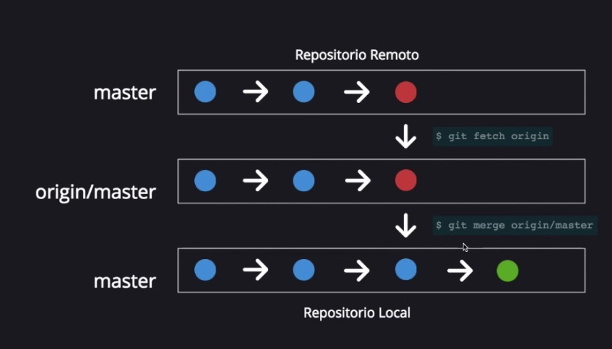
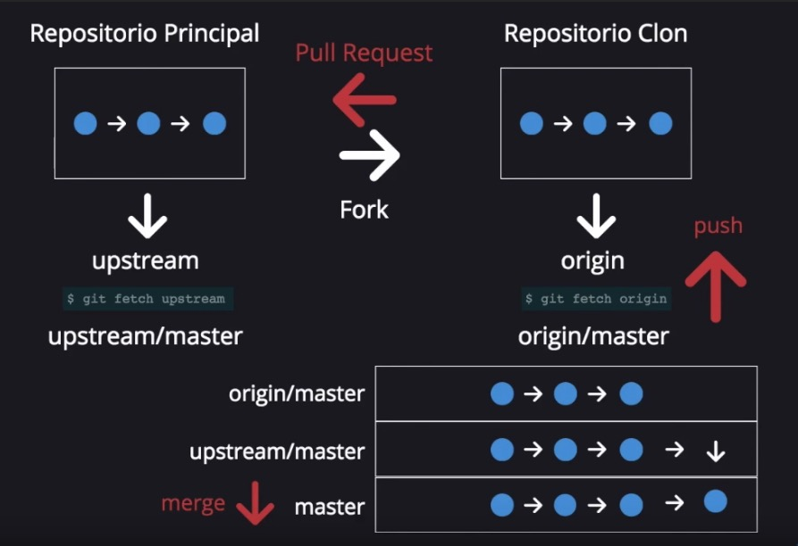
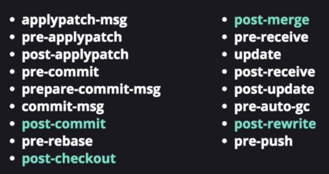

# GIT
## Comandos básicos
Crear un repositorio nuevo:  

```
# Crear carpeta e ir a ella
mkdir repositorio
cd repositorio 

# Crear y subir repositorio
git init
touch README.md
git add . # añade todo, tambien git add * o -A
git commit -m "Nombre del commit"
git push -u origin master

```

Clonar un repositorio:  
`git clone /path/repo.git`


__Información básica:__

* Estado de la sincronización: `git status`
* Log de los commits: `git log`
* Obtener información sobre algo: `git help`


## Explicación básica de Git

Tenemos tres zonas locales y una remota:

* WD (Working directory): archivos actuales
* Index (Staging area): area de trabajo
* HEAD (Local repo): el ultimo commit
* MASTER (Remote repo, Github)


### ADD & COMMIT

* Para añadir todos los archivos: `git add *`  
* Para añadir uno solo: `git add <archivo>`
* Para hacerlo interactivo: `git add -i`

Para hacer commit: `git commit -m "Nombre"`

Para editar un commit (pero que se guarden los cambios dentro del mismo): `git commit --amend -m "Fix"`

### REPOSITORIO REMOTO

Configurar repositorio remoto (si no está ya configurado):  
`git remote add origin <server>`
`git remote remove origin <server>`

Ver repositorios remotos:
`git remote -v`

Para enviar los cambios:  
`git push origin <rama>`

Generalmente usaremos `git push origin master`


## Ramas


_Master_ es la rama estable por defecto.

Para ver las ramas: `git branch`
	* Para ver las ramas ocultas `git branch -a`

Para cambiar de rama: `git checkout <rama>`

Modificar ramas:

```
git checkout -b rama1 # crear
git branch -d rama1 # eliminar rama local
git push origin --delete rama-remota # eliminar rama remota
```
Recuerda que al crear una rama se crea a partir del commit donde estamos ahora.

Enviar una rama al repositorio remoto: `git push origin <rama>`

### Fusionar ramas

Se crea un nuevo commit con la fusión de las dos ramas. Para ello:

1. Cambiamos a la rama que queremos como base `git checkout master`
2. Fusionamos con la rama destino `git merge rama-secundaria`

Hay dos tipos de fusión:

* __Fast-forward__: automática, se have sola. Ocurre cuando trabajamos con archivos diferentes o lineas de codigo distintas.
* __Manual-merge__: cuando hay conflictos, somos nosotros los que debemos resolverlos a mano, editando los archivos. Ocurre al trabajar con mismos archivos o líneas de código.


## Sincronización

Podemos hacerlo de dos formas:

* Si queremos integrar los archivos: `git pull` (hace a la vez remote > HEAD > integra en WD). Típico: `git pull origin master`
* Si queremos tener más control: `git fetch` + `git merge`.
	* `git fetch` sirve para traer archivos del repositorio remoto al local HEAD (pero no al WD). Tipico: `git fetch origin`
	* `git merge <rama>`mezcla el contenido del repo local con el del WD. Típico: `git merge origin/master`

`git pull` solo funciona si no hay confictos ('auto-merge'). Sino, habrá que hacer manual-merge (ver [punto anterior](#fusionar-ramas)).



Git te crea un archivo intermedio con los cambios de los dos para que tu lo edites. Además podemos ver las diferencias entre archivos:  
`git diff <source-branch> <target-branch>`

### Fork

Un fork es un clon de un repositorio. Cuando hacemos un fork (lo haremos en github):

* Al repositorio principal se le llama upstream/master.
* Al repositorio clon se le llama origin/master



Por tanto a la hora de hacer `git fetch` tenemos que tener en cuenta si hacer:
* `git fetch origin` para actualizar los cambios que has hecho tú o tu organización (en tu propio código actualizado).
* `git fetch upstream` para actualizar los cambios del repositorio origen (ejemplo: el codigo fuente del programa).

Si no tenemos acceso a la organización, podemos hacer un pull-request (dentro del repositorio forkeado, y aparece automáticamente en el proyecto base).


## Tagging

Sirve sobre todo para añadir nombres de versión a los commits (ej: v1.2).

Añadir versión al ultimo commit:
`git tag 1.0.0`

Añadir versión a un commit concreto:

```
git log # para ver la id del commit
git tag 1.0.0 <idcommit>
```

Eliminar una etiqueta: `git tag -d v2`


__Annotated vs lightweight__:

```
git tag -a v1.4 # lightweight
git tag -a v1.4 -m "my version 1.4" # annotated
```

Segun buenas prácticas:

* Tags lightweight se usan para etiquetado privado o temporal.
* Tags anotadas se usan para release (tienen descripción).


Solo se pueden subir a github tags ANOTADAS. Se suben explicitamente con `git push origin <tag>`.

Tambien se pueden subir todas con `git push --follow-tags`. Ver [aqui](https://stackoverflow.com/questions/5195859/how-do-you-push-a-tag-to-a-remote-repository-using-git) la discusión.

Para poner este comportamiento por defecto: `git config --global push.followTags true
`.

NOTA: antes se subían todas con `git push --tags`pero se desaconseja hacerlo.


## Log

Comandos avanzados del log:

* Ver solo los commits de un autor: `git log --author=santi`
* Ver un log comprimido: `git log --pretty=oneline`
* Ver logtree: `git log --graph --oneline --decorate --all`
* Ver solo archivos cambiados: `git log --name-status`

## Cambios (diff)

Podemos verlo de forma bonita con `git diff --color-words`.

Lo más util es para ver cambios en ultimo commit: `git diff`.

Otros usos:

* Ver cambios entre un archivo modificado y el local: `git diff file.ext`
* Ver cambios entre versiones: `git diff v1-v2`
* Ver cambios entre ramas: `git diff <source-branch> <target-branch>`
	* Ver cambios de archivos entre ramas: `git diff master branch2 ./text.txt`


## Restaurar cambios

**Explicación corta:**

* En entornos *remotos* usar `git revert`, que crea un nuevo commit basado en invertir el último (no elimina commits anteriores).
* En entornos *locales* podemos usar `git reset`, que restaura a un commit anterior y elimina todo rastro de los intermedios, y NO PERMITE HACER PUSH posteriormente (solo con `-f`).


------ 


**Explicación larga:**

* Si hemos hecho el commit pero no el push (cambios solo en local):
	* Volver un archivo al original: `git checkout -- <nombre>`
	* Volver todos los archivos al original: `git checkout .`
	* Eliminar el ultimo commit del repo local (restaurar commit anterior): `git reset --hard HEAD`. *Resets the HEAD to the commit you select, undoes the changes in the index and undoes the changes in your WD*
	* Volver a un commit concreto anterior: `git reset --hard <commit-sha>`
	* Poco usado: `git reset --soft` elimina el commit pero sin tocar el codigo ni los archivos (si solo queremos borrar el commit del log). *Only resets the HEAD to the commit you select*

* Si ya hemos hecho el push (cambios en remoto):
	* `git fetch origin` con
	* `git reset --hard origin/master`
	* o `git revert HEAD` (mejor)

	
Por todo lo anterior, `git reset`se considera INSEGURO y se recomienda no usarlo por el riesgo de pérdida de información.

`git clean`es otra forma de limpiar. No se usarla y no se si me hace falta.


### Avanzado: detach HEAD state

Podemos 'revisar' estados antiguos con `git checkout`; por ejemplo podemos ver un commit antiguo (poniendo el sha del commit) o un tag antiguo (poniendo la versión). Al hacer esto, entramos en un estado de *'detach head state'*, en que HEAD no apunta a master sino a ese punto temporal que le hemos marcado.


Así podemos ver los archivos que había en ese momento, recuperarlos, etc. Cuando hayamos terminado, nada se guardará, y volvemos a nuestro estado 'normal' con `git checkout master`. 

NOTA: _NO guardar commits ni nada en ese estado ya que se eliminará._


## Configuración avanzadda

### Comandos avanzados
* Ver versión instalada: `git --version`
* Configurar datos de usuario: `git config --global user.name "Tu nombre"`, tambien `user.email`
* Eliminar case sensitive de los archivos: `git config core.ignorecase false`
* Si queremos usar colores `git config --global color.ui true`
	* Se verán dos archivos para readme.md y README.md
* More to come


Git usa `vi`como editor principal (se puede cambiar a `vim` o `nano`)

* `:q` salir
* `:wq` salir y guardar


### Gitignore

En `.gitignore` añadimos archivos que no quedamos sincronizar:

* `.DS_store`
* `.ipynb_checkpoints/` carpetas
* Desde la terminal: `echo .DS_store >> .gitignore`

Si queremos eliminar un archivo remoto al que ya hemos hecho push antes de añadirlo a .gitignore: `git rm -r --cached <carpeta>`

Para ver patrones de exclusión, [aquí](https://www.atlassian.com/git/tutorials/saving-changes/gitignore).

### Git hooks

Son scripts que se pueden ejecutar cuando hacemos algo. Ej.: cuando hacemos un commit, podemos programarlo para hacerlo algo.

Para ello, entrar en `.git/hooks` y crear un archivo (ej: `touch post-commit`), y ese archivo que sea un script.



### Otros

* Interfaz gráfica git: `gitk`
* `git stash` deja aparcados temporalmente cambios para que no afecten al commit (no creo que lo use. Más info [aqui](https://www.atlassian.com/git/tutorials/saving-changes/git-stash).
* `git blame` sirve para ver especificamente que ha hecho cada autor y así dilucidar problemas y errores en el código.

## Github

* Pull requests: en repositorios publicos o compartidos, para establecer 
* Issues: para establecer problemas y cosas que hay que arreglar. Podemos establecer etiquetas.
* Milestones: son colecciones de issues que hay que arreglar. Generalmente son para establecer limites temporales (para hacer versiones etc).
* Stats: podemos ver estadísticas y gráficos del proyecto.


## Bibliografía

* [Git, the simple guide](https://rogerdudler.github.io/git-guide/) by Roger Dudler
* [Learn Git basics under 10 minutes](https://www.freecodecamp.org/news/learn-the-basics-of-git-in-under-10-minutes-da548267cc91/) de FreeCodeCamp
* [Tutorial git](http://flowsta.github.io/github/) de Flowsta
* [Curso Youtube Introducción a GIT]https://www.youtube.com/watch?v=zH3I1DZNovk&list=PL9xYXqvLX2kMUrXTvDY6GI2hgacfy0rId) de CodigoFacilito
* [Tutorial Git de Atlassian](https://www.atlassian.com/git/tutorials)


# Github Pages

## Conceptos básicos
Sirve para alojar web directamente en github.

Lo primero es crear un repo que será `<nombreusuario>.github.io`. Ese será el principal.

Cada repo podrá ser una carpeta a la que se accederá con `*.github.io/repo`. 
Para ello hay tres formas de habilitarlo en `Settings`:

* Habilitar el repo como web (master)
* Habilitar la rama gh-pages como web
* Habilitar la carpeta `/docs` del repo como web

Tambien podemos cambiar el tema directamente con la web de Github.

## Uso de jekyll

Para crear páginas de github-pages está integrado jekyll que es un creador de páginas estáticas a partir de elementos dinámicos (MD o html, con estilos css etc). No soporta php.

Orden de preferencia de archivos: index.html > index.md > README.md

Archivos que hay que crear: `about.md`


Recuerda el 'header block' en el inicio de los archivos (md, html...)

```
---
Header block (al inicio)
---
```


### Jekyll sin integrar en GH-pages

```
gem install jekyll bundle
jekyll new <blogname>
cd <blogname>
jekyll serve
```

Tambien podemos ejecutarlo para que se vean los cambios en tiempo real:
`bundle exec jekyll serve --livereload`

Cosas que podemos cambiar en `_config.yml`:

* baseurl y url: pondremos el directorio y subdirectorio, para que no haya errores en las rutas de los archivos.
* theme: el nombre del tema
* plugins

Si es para usarlo con github-pages, hemos de cambiar en `Gemfile` la parte que pone `gem jekyll` por `gem github-pages`.
Si algo no funciona: `bundle update`


# Otras apps Github

## Github classroom

https://classroom.github.com/

Sirve para hacer clase y enseñanza

## Github packages

Sirve para hacer paquetes que se instalan con `npm`

## Github projects

Sirve para crear proyectos y hacer listas de tareas dentro del repositorio.
