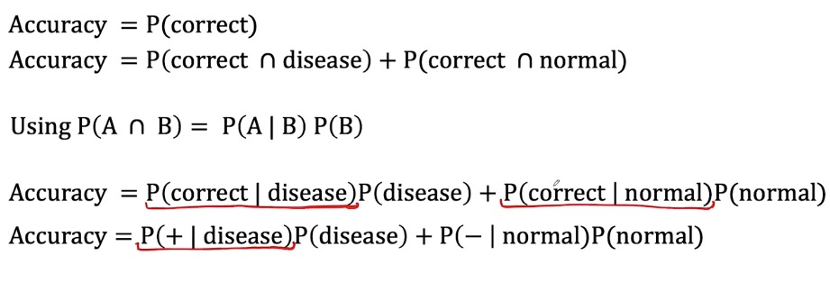
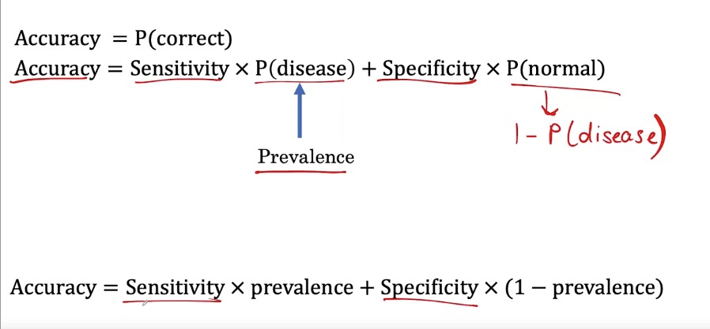
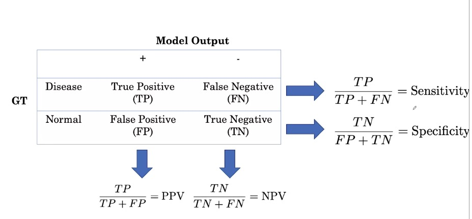
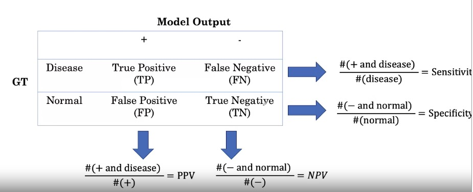
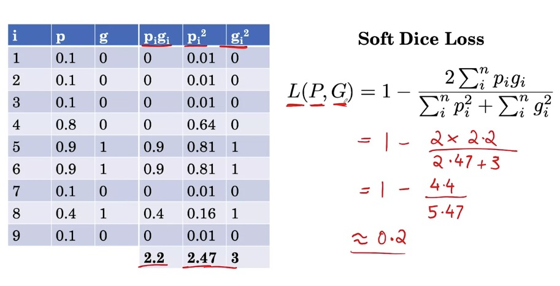

# CURSO 1 MEDICAL IMAGING DIAGNOSIS

* Aprender el uso del ground truth para etiquetar dataset
* Aprender a usar datos balanceados
* Aprender a hacer subtareas en histologia (con imagenes de alta resolucion, hacerlas pequeñas, haciendo parches)


Medical challenges:

* Class imbalance --> weighted loss / resampling
* Multi-task --> multi-label loss
* Dataset size --> transfer learning + data augmentation


EDAs:
```python
df.info() # tipos de variables
df.shape() # filas y columnas

# contar que los pacientes son unicos
train_df['PatientId'].count() #total
train_df['PatientId'].value_counts().shape[0] #unicos

train_df.columns # == train_df.keys()

# print labels
for column in columns:
    print(f"The class {column} has {train_df[column].sum()} samples")
```

With images we can get info like this:

```python
print(f"The dimensions of the image are {raw_image.shape[0]} pixels width and {raw_image.shape[1]} pixels height, one single color channel")
print(f"The maximum pixel value is {raw_image.max():.4f} and the minimum is {raw_image.min():.4f}")
print(f"The mean value of the pixels is {raw_image.mean():.4f} and the standard deviation is {raw_image.std():.4f}")
```


Generally the output is **prediction probabilities** for each label.
Loss function compares the error between the label and the prediction probability.


CLASS IMBALANCE

Dado que la mayor parte de la contribucion al loss total procede de ejemplos normales, esto provoca que la clasificación no se haga correctamente.

Por tanto, al binary loss se le aplica un peso (para ponderar los ejemplos positivos y negativos), y así que el loss total contribuya igual para los ejemplos positivos que para los negativos.

$$loss_{neg}^{(i)} = -1 \times weight_{neg}^{(i)} \times (1- y^{(i)}) \times log(1 - \hat{y}^{(i)} + \epsilon)$$

Se le añade epsilon para evitar que haga log de 0.
$$\epsilon = \text{a tiny positive number}$$

Por eso se le llama weighted loss.

Otro procedimiento es RESAMPLING que se hace en el dataset para conseguir que haya el mismo numero de normales y anormales.

Se puede hacer mediante oversampling de la clase inferior o undersampling de la clase superior (que suele significar dejar sin utilizar ejemplos normales).


MULTI-TASK CHALLENGE

Consiste en que queremos predecir varias enfermedades o problemas a la vez; por tanto necesitariamos varios modelos.

Pero podemos hacerlo solo de una vez y ademas eso es bueno porque las caracteristicas se comparten y es más rápido.

Para ello tenemos que modificar el loss de binary a multi-task setting:  

El multi-label loss sería el loss total que consiste en sumar los componentes indviduales del loss (de cada patologia por ej). 
De ahí simplemente tenemos que ponderar el loss para cada output utilizando el factor de weighted que le corresponde segun lo que hemos visto en el apartado anterior.

DATASET SIZE

Muchas veces no tenemos muchos datos (no tenemos millones como hace falta, sino 10000-100.000 ejempls). soluciones:

* transfer learning: entrenar para otra tarea y así aplicar su conocimiento en otra red médica (pretraining --> fine tuning)
    * early layers = general features
    * later layers = higher-level features

* generate more training samples = data augmentation
    * aplicar rotacion, zoom, cambio brillo, ...
    * deben REFLEJAR variaciones que existan en la vida real
    * deben PRESERVAR las labels (no provocar que cambie la patología)
    * ej: rotate-flip para derma, rotate+crop+color noise para histopato


SETS

* training data se separa entre
    * training set ) development of models
    * validation set = tuning and selection of models

a veces se hace cross-validation entre ellos

* test set = reporting of results


3 challenges in medicine:

* patient overlap = we have to make each set independent
* set sampling
* ground truth 


PATIENT OVERLAP
a veces memorizan caracteristicas de un paciente que esta en dos sets distintos y esto da lugar a una sobreestimación de la calidad del test set.

Forma parte del data leakage.

Pasos:
1. Extract patient IDs from the train and validation sets
2. Convert these arrays of numbers into `set()` datatypes for easy comparison
3. Identify patient overlap in the intersection of the two sets


Una forma de evitar este problema es no split per image (ya que asi aparecen imagenees del mismo paciente), sino usar split by patient, ya que solo aparece un paciente por set y por tanto no hay problema.


SET SAMPLING

al haber pocos casos, puede que al hacer la particion en test set haya pocos samples de patologia.

Por ello se suele poner que debe haber un % minimo de la clase minoritaria (a veces se pone un 50%).

generalmente primero se samplea el test set, luego el validation (que debe tener una distribución igual al test set)

por ultimo ya se samplea el train set


GROUND TRUTH (REFERENCE STANDARD)

Generalmente en medicina hay **consensus voting**, pero se puede hacer tanto como una sola voz como varias.

**More definitive test:** Tambien se puede usar un test mejor (confirmatorio), como el tc con la rx simple.


NOTAS DEL EJERCICIO 1

* Distintos significados de 'clase': puede ser las distintas patologías o enfermedades, pueden ser la etiqueta de enfermedad positiva o negativa, o tambien puede referirse a la clase de software (como ImageDataGenerator)


we need to build a new generator for validation and testing data. 

**Why can't we use the same generator as for the training data?**


Look back at the generator we wrote for the training data. 
- It normalizes each image **per batch**, meaning that it uses batch statistics. 
- We should not do this with the test and validation data, since in a real life scenario we don't process incoming images a batch at a time (we process one image at a time). 
- Knowing the average per batch of test data would effectively give our model an advantage.  
    - The model should not have any information about the test data.

What we need to do is normalize incoming test data using the statistics **computed from the training set**. 
* We implement this in the function below. 
* There is one technical note. Ideally, we would want to compute our sample mean and standard deviation using the entire training set. 
* However, since this is extremely large, that would be very time consuming. 
* In the interest of time, we'll take a random sample of the dataset and calcualte the sample mean and sample standard deviation.

Para ello, hay que hacer un ImageDataGenerator().fit(training_data) para que entrene con la media y la desviacion estandar :

```python
    # get data sample
    batch = raw_train_generator.next()
    data_sample = batch[0]

    # use sample to fit mean and std for test set generator
    image_generator = ImageDataGenerator(
        featurewise_center=True,
        featurewise_std_normalization= True)
    
    # fit generator to sample from training data
    image_generator.fit(data_sample)
```

Para mostrar imagenes de un generador:

```python
x, y = train_generator.__getitem__(0)
plt.imshow(x[0]);
```

A la hora de balancear para el cross-entropy weights, lo más facil para obtener 
$$w_{pos} \times freq_{p} = w_{neg} \times freq_{n},$$

es igualar pesos a frecuencias:

$$w_{pos} = freq_{neg}$$
$$w_{neg} = freq_{pos}$$

Tambien hemos visto como hacer gradcams


# SEMANA 2 

Metrics =

accuracy = correctamente clasificados / total
la probabilidad de ser correcto se puede dividir en la suma de la probabilidad de que sea correcto y este enfermo y de que sea sano

sensititivy (true positive rate) --> los positivos entre lso ENFERMOS
specificity (true negative rate) --> los positivos entre los SANOS




la otra parte que faltea es la pREVALENCIA.
por tanto la accuracy seria como una media ponderada entre la sensibilidad y la especificidad.
la prevalencia es los enfermos entre los totales.


generalmente la pregunta clinica es distinta, es, SIENDO POSITIVO, CUAL ES LA PROBABILIDAD DE QUE SEA ENFERMO
esto se suele aplicar a los test diagnosticos, y es el valor predictivo.


como se relacionan s-e con valores predictivos? con las confusion matrix
(ver imagen guardada)

además, hay forma de calcular los valores predictivos teniendo la prevalencia, s y e


$PPV = \frac{sensitivity \times prevalence}{sensitivity \times prevalence + (1 - specificity) \times (1 - prevalence)}$




ROC CURVE

nos permite plot s y e de forma gráfica eligiendo un ubral (tresold) sobre el cual se elige si el paciente es positivo o negativo.

la elección del umbral (operating point) afecta al valor de la sensibildad y especificdad

si aumentamos el numbral, tendremos una mayor especificidad y una menor sensibilidad (cogeremos menos pacientes pero estaremos más seguros de que son enfermos)

INTERVALOS DE CONFIANZA

como es imposible conseguir el valor real de una población, se usa una muestra de pacientes para conseguir un valor estimado.

los intervalos de confianza nos permiten decir que un valor estimado está, con una confianza de x%, en un intervalo [x]

SI: que con un 95% de confianza, un valor está en el intervalo []

NO quiere decir que haya un 95% de probababilidad de que p esté en el intervalo []
TAMPOCO que el 95% de las p muestrales (sample accuracies) estén en el intervalo []

Es más complejo y requiere hacer 'varios experimentos', por tanto, quiere decir que en repeated sampling, este metodo produce intervalos que incluyen la p de la población en un 95% de las muestras.


En la práctica solo se calcula el intervalo de confianza de uNA muestra, y no de muchas, y solemos aceptar que en el 95% de las ocasiones incluirá el valor poblacional; esto es debido a que el tamaño muestral incluye en la anchura del intervalo de confianza (ya que tendremos una mejor estimación del valor poblacional).
Aunque tengamos el mismo valor estimado, el intervalo será más estrecho si tenemos más tamaño muestral).

"A 95\% confidence interval for an estimate $\hat{s}$ of a parameter $s$ is an interval $I = (a, b)$ such that 95\% of the time when the experiment is run, the true value $s$ is contained in $I$. More concretely, if we were to run the experiment many times, then the fraction of those experiments for which $I$ contains the true parameter would tend towards 95\%."


EJERCICIO SEMANA 2

Hay que tener en cuenta que la SE y E no dependne de la prevalencia, solo consideran la gente en esa misma clase (o enfermos o sanos).

Forma de hacer bootstraping (ir cogiendo ejemplos de pacientes con recambio para calcular el intervalo de confianza de algunos estimadores):

```python
def bootstrap_auc(y, pred, classes, bootstraps = 100, fold_size = 1000):
    statistics = np.zeros((len(classes), bootstraps))

    for c in range(len(classes)):
        df = pd.DataFrame(columns=['y', 'pred'])
        df.loc[:, 'y'] = y[:, c]
        df.loc[:, 'pred'] = pred[:, c]
        # get positive examples for stratified sampling
        df_pos = df[df.y == 1]
        df_neg = df[df.y == 0]
        prevalence = len(df_pos) / len(df)
        for i in range(bootstraps):
            # stratified sampling of positive and negative examples
            pos_sample = df_pos.sample(n = int(fold_size * prevalence), replace=True)
            neg_sample = df_neg.sample(n = int(fold_size * (1-prevalence)), replace=True)

            y_sample = np.concatenate([pos_sample.y.values, neg_sample.y.values])
            pred_sample = np.concatenate([pos_sample.pred.values, neg_sample.pred.values])
            score = roc_auc_score(y_sample, pred_sample)
            statistics[c][i] = score
    return statistics

statistics = bootstrap_auc(y, pred, class_labels)
```

si el intervalo de confianza incluye el umbral entonces el valor no es representativo.


Cuando las clases son desbalanceadas, la curva precision-recall es util.

precision es ppv y recall es sensibilidad.

In information retrieval
- Precision is a measure of result relevancy and that is equivalent to our previously defined PPV. 
- Recall is a measure of how many truly relevant results are returned and that is equivalent to our previously defined sensitivity measure.

Se supone que las estimaciones de una label, que estarán entre 0-1, deben estar igualmente distribuidas entre 0-1. Para comprobarlo podemos usar la curva de calibración (sklearn) en que vemos la distribución media de nuestras predicciones, que debe estár lo más cerca posible de la diagonal.


## SEMANA 3 SEGMENTACION

[Dataset para segmentación médica](https://drive.google.com/drive/folders/1HqEgzS8BV2c7xYNrZdEAnrHk7osJJ--2)


Podemos utilizar cada secuencia de RM como si fuera un canal RGB (incluso usar más canales).

se combinan, por ello hay que ALINEAR CORRECTAMENTE, lo que se llama image registration.

generalmente se hace en un plano (en el mejor el axial).
y ya de ahí como se hace un volumen 3d pdemos obtener lod eás.

hacemos eso con todas las slices ahora, para la segmentación:

* 2d approach: se van coloreando las slices una por una y luego se combinan. Lo malo: que perdemos contexto enntre lonchas.
* 3d approach: no se puede pasar todo el volumen a la vez por problemas de memoria, por tanto se pasan pequeños 3d subvolumenes (con w x h x grosor), y los vamos pasando uno por uno al modelo y luego los unimos. Lo malo es que perdemos contexto tambien entre subvolumenes.


Una de las arquitecturas más importantes para segmentacion es U-NET:

* contracting path = CNN normal
* expanding path = take small feature maps to get back the original size with 

existen 2d y 3d unet
la unica diferencia es que los pooling y las convoluciones son 2d o 3d

[entender unet](https://towardsdatascience.com/u-net-b229b32b4a71)


DATA AUGMENTATION

Hay varias diferencas respecto a la aplicación 3d:

* si aplicamos rotacion a la imagen al aumentar, tambien debemos rotar el output (y) ya que queremos predecir ubicacion de pixels
* al tener 3d volumenes las transformaciones deben aplicarse a 3d no solo a 2d


En cuanto al loss, se suele usar soft dice loss, que calcula el error entre el mapa real y la predicción, midiendo el solapamiento (overlap); queremos que el numerador sea grande y el denominador sea pequeño
(ver imagen)


Challenges to make then routine in medical practise:

* generalisation: difficult due to diferent diseases (us-india)
* technology is different between hospitals

Para poder medir generalizacion hay que verificar con un test set EXTERNO que sea de la poblacion que queremos ver.
Si no vemos que funciona, debemos añadir training data de esa poblacion y ahcer fine-tuning.

además es necesario tunear modelos para filtrar los datos que no nos interesen o incluirlos en el modelo (ej: placas laterales), que no estan incluidas.

Another challenge son la necesidad de metricas que se correlacionen con el outcome del paciente. Ya que AUROC, dice score... no se correlacinoann con el efecto del modelo en el paciente, en si el paciente mejora gracias al modelo.

* un approach es decision curve analysis, que puede ayudar a cuantificar la mejora del apciente 
* otro es randomized controlled trials (comparamos outcomes de pacientes a los que se aplica el modelo y a los que no)


además en la realidad mediriamos el efecto del modelo no solo en global, sino el especcfiico: ej efecto segun edad, sexo y nivel socioeconomico.

es necesario evitar los bias (ej: algoritmos de deteccion de melanoma que funcionan peor en negros)

otro es la interpretability (como funcionan los modelos) para poder entender como funcionan y como arreglarlos si no funcionan.


EJERCICO 3

Cosas que se suelen hacer en segmentacion:

* generar subsamples de volumen e intentar que contengan tejido patologico (o cosas a segmentar), y no solo ruido de fondo (como background de una rm).
* estandarizacion 0-1

Archivo para leer los fiftys = `nibabel.get_fdata()`.

cross entropy loss = heavy class imbalance (bad for segmentation, not many postitive regions)
better Dice similarity (measure how well two contours overlap)
0 = mismatch. 1 = perfect match. se hace con sets


Soft dice loss


Diferencia entre fit y generadores

https://www.geeksforgeeks.org/keras-fit-and-keras-fit_generator/


#### Using the validation set for testing
- Note: since we didn't do cross validation tuning on the final model, it's okay to use the validation set.
- For real life implementations, however, you would want to do cross validation as usual to choose hyperparamters and then use a hold out test set to assess performance


# CURSO 2: MEDICAL PROGNOSIS

Medical prognosis is predicting the risk of a future event (death, heart attack, stroke...)

Is a clinically useful task:

* Informing patients (risk of illness, survival...)
* Useful for guiding treatment (whether a patient should get drugs, receive end-of-life care...)


Input: profile of patient (clinical history, physical exams, labs, imaging)
-->
Prognostic Model
-->
Output: risk score (number or probability %)

Ej. CHADS_{2}DS_{2}-VASc
MELD Score: riesgo muerte en 3 meses en pacientes con hepatopatía terminal

Using the natural log of the features instead of the features themselves is common when there's reason to believe that the relationship between the risk and the features is linear in the natural log of the features.

EJ3: ASCVD+ : riesgo de enf cardiovascular en >20a sin infarto previo

Cuando tenemos caracteristicas con coeficientes negativos quire decir que disminuye el score (disminuye el riesgo).

RISK SCORE COMPUTATION
