# CURSO 1 MEDICAL IMAGING DIAGNOSIS

## SEMANA 1 CLASIFICACION

* Aprender el uso del ground truth para etiquetar dataset
* Aprender a usar datos balanceados
* Aprender a hacer subtareas en histologia (con imagenes de alta resolucion, hacerlas pequeñas, haciendo parches)


Medical challenges:

* Class imbalance --> weighted loss / resampling
* Multi-task --> multi-label loss
* Dataset size --> transfer learning + data augmentation


**EDAs:**
```python
df.info() # tipos de variables
df.shape() # filas y columnas

# contar que los pacientes son unicos
train_df['PatientId'].count() #total
train_df['PatientId'].value_counts().shape[0] #unicos

train_df.columns # == train_df.keys()

# print labels
for column in columns:
    print(f"The class {column} has {train_df[column].sum()} samples")
```

With images we can get info like this:

```python
print(f"The dimensions of the image are {raw_image.shape[0]} pixels width and {raw_image.shape[1]} pixels height, one single color channel")
print(f"The maximum pixel value is {raw_image.max():.4f} and the minimum is {raw_image.min():.4f}")
print(f"The mean value of the pixels is {raw_image.mean():.4f} and the standard deviation is {raw_image.std():.4f}")
```


Generally the output is **prediction probabilities** for each label.
Loss function compares the error between the label and the prediction probability.


### CLASS IMBALANCE

Dado que la mayor parte de la contribucion al loss total procede de ejemplos normales, esto provoca que la clasificación no se haga correctamente.

Por tanto, al binary loss se le aplica un peso (para ponderar los ejemplos positivos y negativos), y así que el loss total contribuya igual para los ejemplos positivos que para los negativos.

$$loss_{neg}^{(i)} = -1 \times weight_{neg}^{(i)} \times (1- y^{(i)}) \times log(1 - \hat{y}^{(i)} + \epsilon)$$

Se le añade epsilon para evitar que haga log de 0.
$$\epsilon = \text{a tiny positive number}$$

Por eso se le llama weighted loss.

Otro procedimiento es **RESAMPLING** que se hace en el dataset para conseguir que haya el mismo numero de normales y anormales.

Se puede hacer mediante oversampling de la clase inferior o undersampling de la clase superior (que suele significar dejar sin utilizar ejemplos normales).


### MULTI-TASK CHALLENGE

Consiste en que queremos predecir varias enfermedades o problemas a la vez; por tanto necesitariamos varios modelos.

Pero podemos hacerlo solo de una vez y ademas eso es bueno porque las caracteristicas se comparten y es más rápido.

Para ello tenemos que modificar el loss de binary a multi-task setting:  

El **multi-label loss** sería el loss total que consiste en sumar los componentes indviduales del loss (de cada patologia por ej). 
De ahí simplemente tenemos que ponderar el loss para cada output utilizando el factor de weighted que le corresponde segun lo que hemos visto en el apartado anterior.

### DATASET SIZE

Muchas veces no tenemos muchos datos (no tenemos millones como hace falta, sino 10000-100.000 ejempls). soluciones:

* _Transfer learning:_ entrenar para otra tarea y así aplicar su conocimiento en otra red médica (pretraining --> fine tuning)
    * early layers = general features
    * later layers = higher-level features

* _Data augmentation:_ generate more training samples
    * aplicar rotacion, zoom, cambio brillo, ...
    * deben REFLEJAR variaciones que existan en la vida real
    * deben PRESERVAR las labels (no provocar que cambie la patología)
    * ej: rotate-flip para derma, rotate+crop+color noise para histopato


### SETS

* Training data se separa entre
    * training set = development of models
    * validation set = tuning and selection of models

A veces se hace cross-validation entre ellos

* test set = reporting of results


3 challenges in medicine con los sets:

* patient overlap = we have to make each set independent
* set sampling
* ground truth 

#### PATIENT OVERLAP


A veces memorizan caracteristicas de un paciente que esta en dos sets distintos y esto da lugar a una sobreestimación de la calidad del test set.

Forma parte del data leakage.

Pasos:
1. Extract patient IDs from the train and validation sets
2. Convert these arrays of numbers into `set()` datatypes for easy comparison
3. Identify patient overlap in the intersection of the two sets


Una forma de evitar este problema es no split per image (ya que asi aparecen imagenees del mismo paciente), sino **usar split by patient**, ya que solo aparece un paciente por set y por tanto no hay problema.


#### SET SAMPLING

Al haber pocos casos, puede que al hacer la particion en test set haya pocos samples de patologia.

Por ello se suele poner que debe haber un % minimo de la clase minoritaria (a veces se pone un 50%).

Generalmente primero se samplea el test set, luego el validation (que debe tener una distribución igual al test set); por ultimo ya se samplea el train set.


#### GROUND TRUTH (REFERENCE STANDARD)

Generalmente en medicina hay **consensus voting**, pero se puede hacer tanto como una sola voz como varias.

**More definitive test:** Tambien se puede usar un test mejor (confirmatorio), como el tc con la rx simple.


### NOTAS DEL EJERCICIO 1

1- Distintos significados de 'clase': puede ser las distintas patologías o enfermedades, pueden ser la etiqueta de enfermedad positiva o negativa, o tambien puede referirse a la clase de software (como ImageDataGenerator)


2- We need to build a new generator for validation and testing data. 

**Why can't we use the same generator as for the training data?**


Look back at the generator we wrote for the training data. 
- It normalizes each image **per batch**, meaning that it uses batch statistics. 
- We should not do this with the test and validation data, since in a real life scenario we don't process incoming images a batch at a time (we process one image at a time). 
- Knowing the average per batch of test data would effectively give our model an advantage.  
    - The model should not have any information about the test data.

What we need to do is normalize incoming test data using the statistics **computed from the training set**. 
* We implement this in the function below. 
* There is one technical note. Ideally, we would want to compute our sample mean and standard deviation using the entire training set. 
* However, since this is extremely large, that would be very time consuming. 
* In the interest of time, we'll take a random sample of the dataset and calcualte the sample mean and sample standard deviation.

Para ello, hay que hacer un ImageDataGenerator().fit(training_data) para que entrene con la media y la desviacion estandar :

```python
    # get data sample
    batch = raw_train_generator.next()
    data_sample = batch[0]

    # use sample to fit mean and std for test set generator
    image_generator = ImageDataGenerator(
        featurewise_center=True,
        featurewise_std_normalization= True)
    
    # fit generator to sample from training data
    image_generator.fit(data_sample)
```

Para mostrar imagenes de un generador:

```python
x, y = train_generator.__getitem__(0)
plt.imshow(x[0]);
```

A la hora de balancear para el cross-entropy weights, lo más facil para obtener 
$$w_{pos} \times freq_{p} = w_{neg} \times freq_{n},$$

es igualar pesos a frecuencias:

$$w_{pos} = freq_{neg}$$
$$w_{neg} = freq_{pos}$$

Tambien hemos visto como hacer **gradcams** para interpretability.


## SEMANA 2 METRICS


**Accuracy** =  correctamente clasificados / total

La probabilidad de ser correcto se puede dividir en la suma de la probabilidad de que sea correcto y este enfermo y de que sea sano

**sensititivy** (true positive rate) --> los positivos entre los ENFERMOS

**specificity** (true negative rate) --> los positivos entre los SANOS


La otra parte que falta es la **PREVALENCIA**. Por tanto la accuracy seria como una media ponderada entre la sensibilidad y la especificidad.

Prevalencia = enfermos entre los totales.


Generalmente la pregunta clinica es distinta, es, **¿SIENDO POSITIVO, CUAL ES LA PROBABILIDAD DE QUE SEA ENFERMO?**
esto se suele aplicar a los test diagnosticos, y es el **valor predictivo**.


¿como se relacionan s-e con valores predictivos? con las confusion matrix

además, hay forma de calcular los valores predictivos teniendo la prevalencia, s y e


$PPV = \frac{sensitivity \times prevalence}{sensitivity \times prevalence + (1 - specificity) \times (1 - prevalence)}$


**ROC CURVE**

nos permite plot S/E de forma gráfica eligiendo un umbral (threshold) sobre el cual se elige si el paciente es positivo o negativo.

la elección del umbral (operating point) afecta al valor de la sensibildad y especificidad; _si aumentamos el umbral, tendremos una mayor especificidad y una menor sensibilidad_ (cogeremos menos pacientes pero estaremos más seguros de que son enfermos)

**INTERVALOS DE CONFIANZA**

Como es imposible conseguir el valor real de una población, se usa una muestra de pacientes para conseguir un valor estimado.

los intervalos de confianza nos permiten decir que un valor estimado está, con una confianza de x%, en un intervalo [x]


>SI: que con un 95% de confianza, un valor está en el intervalo []

>NO quiere decir que haya un 95% de probababilidad de que p esté en el intervalo []

>>TAMPOCO que el 95% de las p muestrales (sample accuracies) estén en el intervalo []

Es más complejo y requiere hacer 'varios experimentos', por tanto, quiere decir que en repeated sampling, este metodo produce intervalos que incluyen la p de la población en un 95% de las muestras.


En la práctica solo se calcula el intervalo de confianza de UNA muestra, y no de muchas, y solemos aceptar que en el 95% de las ocasiones incluirá el valor poblacional; esto es debido a que el tamaño muestral incluye en la anchura del intervalo de confianza (ya que tendremos una mejor estimación del valor poblacional).

Aunque tengamos el mismo valor estimado, el intervalo será más estrecho si tenemos más tamaño muestral.

>"A 95\% confidence interval for an estimate $\hat{s}$ of a parameter $s$ is an interval $I = (a, b)$ such that 95\% of the time when the experiment is run, the true value $s$ is contained in $I$. More concretely, if we were to run the experiment many times, then the fraction of those experiments for which $I$ contains the true parameter would tend towards 95\%."


### EJERCICIO SEMANA 2

Hay que tener en cuenta que la S y E no dependen de la prevalencia, solo consideran la gente en esa misma clase (o enfermos o sanos).

Forma de hacer bootstraping (ir cogiendo ejemplos de pacientes con recambio para calcular el intervalo de confianza de algunos estimadores):

```python
def bootstrap_auc(y, pred, classes, bootstraps = 100, fold_size = 1000):
    statistics = np.zeros((len(classes), bootstraps))

    for c in range(len(classes)):
        df = pd.DataFrame(columns=['y', 'pred'])
        df.loc[:, 'y'] = y[:, c]
        df.loc[:, 'pred'] = pred[:, c]
        # get positive examples for stratified sampling
        df_pos = df[df.y == 1]
        df_neg = df[df.y == 0]
        prevalence = len(df_pos) / len(df)
        for i in range(bootstraps):
            # stratified sampling of positive and negative examples
            pos_sample = df_pos.sample(n = int(fold_size * prevalence), replace=True)
            neg_sample = df_neg.sample(n = int(fold_size * (1-prevalence)), replace=True)

            y_sample = np.concatenate([pos_sample.y.values, neg_sample.y.values])
            pred_sample = np.concatenate([pos_sample.pred.values, neg_sample.pred.values])
            score = roc_auc_score(y_sample, pred_sample)
            statistics[c][i] = score
    return statistics

statistics = bootstrap_auc(y, pred, class_labels)
```

Si el intervalo de confianza incluye el umbral entonces el valor no es representativo.


Cuando las clases son desbalanceadas, la curva precision-recall es util.

Precision es ppv y recall es sensibilidad.

In information retrieval
- Precision is a measure of result relevancy and that is equivalent to our previously defined PPV. 
- Recall is a measure of how many truly relevant results are returned and that is equivalent to our previously defined sensitivity measure.

Se supone que las estimaciones de una label, que estarán entre 0-1, deben estar igualmente distribuidas entre 0-1. Para comprobarlo podemos usar la curva de calibración (sklearn) en que vemos la distribución media de nuestras predicciones, que debe estár lo más cerca posible de la diagonal.


## SEMANA 3 SEGMENTACION

[Dataset para segmentación médica](https://drive.google.com/drive/folders/1HqEgzS8BV2c7xYNrZdEAnrHk7osJJ--2)


Podemos utilizar cada secuencia de RM como si fuera un canal RGB (incluso usar más canales).

Se combinan, por ello hay que ALINEAR CORRECTAMENTE, lo que se llama **image registration**.

Generalmente se hace en un plano (en el mejor el axial).
y ya de ahí como se hace un volumen 3d pdemos obtener lo demas.

Hacemos eso con todas las slices ahora, para la segmentación:

* 2d approach: se van coloreando las slices una por una y luego se combinan. Lo malo: que perdemos contexto entre slices.
* 3d approach: no se puede pasar todo el volumen a la vez por problemas de memoria, por tanto se pasan pequeños 3d subvolumenes (con w x h x grosor), y los vamos pasando uno por uno al modelo y luego los unimos. Lo malo es que perdemos contexto tambien entre subvolumenes.


Una de las arquitecturas más importantes para segmentacion es U-NET:

* contracting path = CNN normal
* expanding path = take small feature maps to get back the original size with 

existen 2d y 3d unet
la unica diferencia es que los pooling y las convoluciones son 2d o 3d

[entender unet](https://towardsdatascience.com/u-net-b229b32b4a71)


### DATA AUGMENTATION

Hay varias diferencas respecto a la aplicación 3d:

* si aplicamos rotacion a la imagen al aumentar, tambien debemos rotar el output (y) ya que queremos predecir ubicacion de pixels
* al tener 3d volumenes las transformaciones deben aplicarse a 3d no solo a 2d


En cuanto al loss, se suele usar **soft dice loss**, que calcula el error entre el mapa real y la predicción, midiendo el solapamiento (overlap); queremos que el numerador sea grande y el denominador sea pequeño
(ver imagen)

### CHALLENGES 

Challenges to make then routine in medical practise:

#### GENERALIZATION

* generalization: difficult due to diferent diseases (us-india)
* technology is different between hospitals

Para poder medir generalizacion hay que verificar con un test set EXTERNO que sea de la poblacion que queremos ver.
Si no vemos que funciona, debemos añadir training data de esa poblacion y hacer fine-tuning.

además es necesario tunear modelos para filtrar los datos que no nos interesen o incluirlos en el modelo (ej: placas laterales), que no estan incluidas.

#### OUTCOME METRICS 

Another challenge son la necesidad de metricas que se correlacionen con el outcome del paciente. Ya que AUROC, dice score... no se correlacinoann con el efecto del modelo en el paciente, en si el paciente mejora gracias al modelo.

* un approach es **decision curve analysis**, que puede ayudar a cuantificar la mejora del apciente 
* otro es **randomized controlled trials** (comparamos outcomes de pacientes a los que se aplica el modelo y a los que no)


además en la realidad mediriamos el efecto del modelo no solo en global, sino el especcfiico: ej efecto segun edad, sexo y nivel socioeconomico.

es necesario evitar los bias (ej: algoritmos de deteccion de melanoma que funcionan peor en negros)

otro es la **interpretability** (como funcionan los modelos) para poder entender como funcionan y como arreglarlos si no funcionan.


### EJERCICIO 3

Cosas que se suelen hacer en segmentacion:

* generar subsamples de volumen e intentar que contengan tejido patologico (o cosas a segmentar), y no solo ruido de fondo (como background de una rm).
* estandarizacion 0-1

Archivo para leer los fiftys = `nibabel.get_fdata()`.

cross entropy loss = heavy class imbalance (bad for segmentation, not many postitive regions)
better Dice similarity (measure how well two contours overlap)
0 = mismatch. 1 = perfect match. se hace con sets


Soft dice loss


Diferencia entre fit y generadores

https://www.geeksforgeeks.org/keras-fit-and-keras-fit_generator/


#### Using the validation set for testing

- Note: since we didn't do cross validation tuning on the final model, it's okay to use the validation set.
- For real life implementations, however, you would want to do cross validation as usual to choose hyperparamters and then use a hold out test set to assess performance


# CURSO 2: MEDICAL PROGNOSIS

## SEMANA 1. PRONOSTICO


Medical prognosis is predicting the risk of a future event (death, heart attack, stroke...)

Is a clinically useful task:

* Informing patients (risk of illness, survival...)
* Useful for guiding treatment (whether a patient should get drugs, receive end-of-life care...)


Input: profile of patient (clinical history, physical exams, labs, imaging)
-->
Prognostic Model
-->
Output: risk score (number or probability %)

Ej. CHADS_{2}DS_{2}-VASc
MELD Score: riesgo muerte en 3 meses en pacientes con hepatopatía terminal

Using the natural log of the features instead of the features themselves is common when there's reason to believe that the relationship between the risk and the features is linear in the natural log of the features.

EJ3: ASCVD+ : riesgo de enf cardiovascular en >20a sin infarto previo

Cuando tenemos caracteristicas con coeficientes negativos quire decir que disminuye el score (disminuye el riesgo).

RISK SCORE COMPUTATION
A la hora de calcular un score riesgo, generalmente se hace teniendo una variable (o su ln) y un coeficiente que se multiplica con esta, y se van sumando.

Muchas veces tambien hay un coeficiente de interacción, que se conforma con la multiplicación de varias variables y la creación de un coeficiente conjunto.
Esto modifica la curva que deja de ser lineal y refleja mejor las influencias de las variables (ej: la edad afecta más a la hipertension en jóvenes que en ancianos).

EVALUATING PROGNOSTIC MODELS

Sirve para evaluar los *risk scores* de varios pacientes.
En general el paciente con peor pronostico tiene mayor score riesgo, y esto se llama que es concordant (concuerda); si no, es non-concordant.
Para parejas de pacientes, pair-concordant.
Risk ties es cuando tenemos un score riesgo igual pero con distinto outcome.
Ties in outcome no se suelen considerar en la evaluacion de modelos pronosticos (cuando hay el mismo outcome con distinto score riesgo), ya que debemos tener distinto outcome.

Cuando los outscomes son diferentes se llama permissible pair (porque se puede utilizar)

Por tanto, para evaluar modelos pronostics:

* +1 a permissible pair que sean concordant
* +`0.5 a permissible pair with risk tie

Esto se llama C-index:

$ C-index = \frac{#concordant_pairs+0.5 x #risk ties} / # permissible pairs

Para ello hay que hacer parejas de todos los pacientes (si hay de A-E: AB, AC, AD, AE, BC, BD, BE, CD, CE, DE) y calcular permissible pairs, concordant pairs, risk ties.


EJERCICIO 1

Los modelos esperan datos normalizados, no datos skewed.
Por ello, una de las formas que se pueden hacer para normalizarlos es aplicarle una funcion logaritmica a los datos
Luego hay que estandarizar los datos (media 0 y sd 1)

Al calcular la media y la sd para hacer la estandarización siempre tenemos que calcularlo en la training data, pero no en el test. Luego se aplica en el test la estandarización usando la media y sd del training data.


## SEMANA 2: DECISION TREES FOR PROGNOSIS

Usaremos decision trees para predecir la mortalidad. El mayor problema es el overfitting.

Los random forest tienen buena predicion con poco overfitting.

Los decission trees van separando el input space en regiones mediante la 'respuesta' a preguntas (mediante splits de los datos).

Los decision trees solo pueden hacer divisiones verticales u horizontales.

Gracias a esto podemos binarizar las probabilidades de riesgo ("zonas" de alto y de bajo riesgo de un evento).

El overfitting es malo y se ve cuando la accuracy es mucho mayor en train que en test.

Una forma de controlarlos es disminuir el valor de `max depth` para tener modelos más simples.
Otra forma es crear `random forests` que son ensembles de decision trees cada uno creado con un random sample with replacement del conjunto total de datos. Tambien se pueden hacer random sample de variables.

Hay otros algoritmos de ensemble que se pueden usar: gradient boosting, XGBoost y LightGBM.

A la hora de crear el algoritmo, podemos pasar los parámetros como un diccionario, pero para desempaquetarlos hay que usar `**` para desempaquetar:

```python
tree_parameters = {'criterion': 'entropy',
                   'max_depth': 10,
                   'min_samples_split': 2
                  }

dt = DecisionTreeClassifier(**tree_parameters)
```


### Identifying missing data

Veremos lo que pasa solo cuando faltan datos de X (no del outcome y).

Lo primero que haremos es separar en train-test y ELIMINAR los pacientes con NA.

* Problema de esto: da modelos muy sesgados (bias).

Por ejemplo, antes de quitarle los NA tenemos una accuracy aceptable y al quitarselo vemos que disminuye.
Muchas veces esto se debe a que las distribuciones de las variables son diferentes entre train/test.

De hecho si hacemos un plot entre la distribución de antes y despues de eliminar los NA, puede que haya diferencias en una zona concreta porque estemos eliminando pacientes de uan zona y esto sea lo que nos da el fallo al entrenar el modelo (porque no tenemos datos suficientes).

Muchas veces se debe a errores sistematicos (ej: que en pacientes jovenes no se mide la TA de normal.)


**Why data can be missing**:

3 categorias:

* _Missing completely at random:_ decidir aleatoriamente si se guarda o no. Generalmente no suele darse; la probabilidad de tener la variable medida es completamente aleatoria: no produce un biased model. `p(missing) = constant`
* _Missing at random:_ missingess dependent only on available information --> hay una decisión no siempre aleatoria de medir una variable. Ej: medir TA a todos los ancianos, y a los jovenes solo a la mitad aleatoriamente. Esto daría un biased model pero solo para los jovenes. `p(missing|young) = 0.5; p(missing| old) = 0`
* _Missing not at random:_ missingness non dependent on information. Ej: que al medico le de tiempo a coger las variables o le pille agobiado o esté tranquilo y le de tiempo. `p(missing) != constant`. Pero como no tenemos la información (porque no está apuntado en ningun sitio si el medico estaba agobiado), pues provoca que creemos bias models.

**Imputation**

Imputation sirve para rellenar los valores vacios (filling missing values).

Lo primero es separar en train_test y ambos deben tener valores NA.

El método más facil es mean imputation que es rellenar con la media.
Si tenemos NA en el test set hay que rellenar los NA usando los valores medios del TRAINING set, no del test.

Lo malo es que no preserva la corelación entre variables.
Hay otra que si lo preserva: regression imputation.

Lo que hace es intentar aprender un modelo lineal para intentar rellenar los valores vacios. Para el test set habria que usar la misma ecuacion que para el train set (obviamente).

```python
from sklearn.experimental import enable_iterative_imputer
from sklearn.impute import SimpleImputer, IterativeImputer

mean_imputer = SimpleImputer(missing_values = np.NaN, strategy='mean')
mean_imputer.fit_transform(df)

reg_imputer = IterativeImputer()
reg_imputer.fit_transform(df)
```

## SEMANA 3: SURVIVAL MODELS

Los modelos de supervivencia son una extensión de los modelos pronósticos, que (en vez de buscar el riesgo de un evento) buscan la probabilidad de supervivencia en un `tiempo t` futuro.

La clave aquí es que pueden responder a la posibilidad de supervivencia a distintos tiempos `t` con un solo modelo  (a diferencia de los modelos pronosticos, que habría que hacer varios modelos).

Survival function: `S(t) = Pr(T > t)`

* Eje x = tiempo `t`
* Eje y = posibilidad de supervivencia en este tiempo t: `S(t)`

Propiedades de la *survival function*:

* La posibilidad de supervivencia nunca puede aumentar con el paso del tiempo (tan solo seguir igual o disminuir).
  * `S(y) <= S(x) si y>=x`
* Comienza en 1 (supervivencia) y conforme la función tiende a infinito, la posibilidad de supervivencia tiende a 0.
  * `S(t) = 1 si t=0`
  * `S(t) = 0 si t=`$\infty$
  
En los survival models, la información que se recoge no es si/no (1/0), sino **CUÁNDO** ocurre: apuntamos el tiempo `t` que transcurre hasta el evento.  
Aunque hay dos problemas:

* End-of-study censoring: Si no hemos observado el evento en ese paciente y termina el estudio, lo indicamos con `t+`. Ej: 36+ meses.
* Loss-to-follow-up censoring: Si el paciente ha decidido salirse del estudio (withdraw), lo mismo: 12+ meses.

Estos son ejemplos de **datos censurados**, que tendremos que tener en cuenta (right-censored en este caso, porque no tenemos información a la derecha de la curva).


Para estimar la función de supervivencia `S(t)` que nos da la probabiliad de supervivencia al tiempo `t` necesitamos los datos de todos los pacientes de la tabla:

$S(t) = \frac{#survived at time t, #total patients}$

El problema lo tenemos con los datos censurados: podríamos hacer una estimación en dos escenarios: que todos los datos censurados siguen vivos o que todos han muerto; la cifra real de supervivencia estará en medio de ambas.

Para estimar la cifra real de supervivencia lo haremos siguiendo la regla de la cadena de probabilidad condicional (chain rule of conditional probability) (la explicación está en los videos):

S(t) = sumproduct 1 - (di = # died at time t / ni = #survival at time t)

$S(t) = \prod_{i=0}^N \left ( 1 - \frac{d_i}{n_i}\right )$

Es decir, se calcula para todos los tiempos t (los presentes en la tabla al menos), el numero de muertos en ESE TIEMPO PRECISO entre los que sobrevivieron a ese tiempo (incluyendolo, >=).

A esto se le llama Kaplan Meier Estimate, y se aplica a todos los pacientes en una muestra.


Así podemos comparar la probabilidad de supervivencia de dos muestras en un mismo tiempo t.

* Lo normal es representar gráficamente la curva de supervivencia con respecto al tiempo
* Cada punto representa la probabilidad de supervivencia en ese tiempo (t)

Para saber si hay diferencias estadísticamente significativas entre las curvas de supervivencia se usa el **Log-Rank test**. Podemos usarlo de `lifelines.statistics.logrank_test`. 

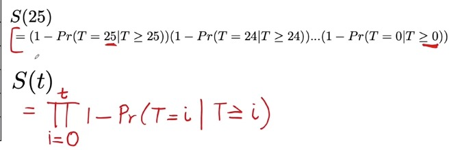
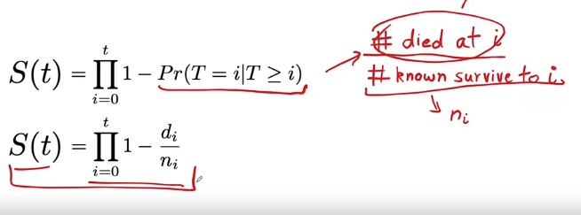


## SEMANA 4 HAZARD FUNCTIONS


Hay dos cosas que van de la mano de la función de supervivencia: la función de riesgo (hazard function) y la funcion del riesgo acumulativo (cumulative hazard function)

Anteriormente hemos visto la funcion de supervivencia, que nos daba la posibilidad de supervivencia pasado un tiempo t.

Tambien podemos calcular la probabilidad de muerte, que es simplemente 1 - supervivencia.

Ahora vamos a ver la funcion de riesgo, que lo que quiere es ver el riesgo INMEDIATO de muerte un paciente si llega a un tiempo t.

hazard -\ lambda(t) = Pr(T=t|T>=t)

Se puede representar graficamente tambien:

*  Bathtub: un tipo de curva que tiene alto riesgo al inicio, luego disminuye bruscamente y va aumentando con el tiempo. Ej. qx o qt.

La funcion riesgo está relacionada con la de superviencia y se puede utilizar una formula para obtener la funcion supervivencia en funcion a la función riesgo y viceversa.

hazard = rate of death if aged t


Cual es el riesgo acumulado del paciente hasta el tiempo t?
CAPITAL LAMBDA, está muy relacionado con el riesgo a tiempo t (hazard), ya que se puede obtener sumando todos los riesgos acumulados hasta ese punto.
/\ (t) = E -\ (t)

Para ello t debe ser continuo (1, 2, 3...)

Vemos como a partir de una curva de supervivencia podemos obtener las tres funciones: supervivencia, riesgo y riesgo acumulado.

ej1:
Cuando hacemos one-hot encoding muchas veces merece la pena convertirlo a float, ya que es lo que espera el modelo.


MDOELO DE COX (COX PROPORTIONAL HAZARD).

El modelo de riesgo poblacional nos da el riesgo conjunto pero no tiene en cuenta variables individuales (es el mismo riesgo para todos los individuos).

El modelo de cox nos permite tener en cuenta diferencias individuales que condicionen diferencias en el riesgo (ejemplo: edad, fumador...). 

$$
\lambda(t, x) = \lambda_0(t)e^{\theta^T X_i}
$$


lambda_individual(t) = lambda_baseline x factor 

El factor está determinado por distintas variables (multiplicados por pesos y sumadas):

factor = exp(Esum variable x weight)

Teniendo en cuenta que el riesgo base es el mismo, podemos comparar los riesgos de distintos pacientes comparando los factores, sin tener en cuenta ni comparar los modelos base de riesgo.

Si vamos disgregando cada una de las variables que aparecen podemos calcular el riesgo relativo asociado a cada una de las variables (ej: el riesgo de fumar con respecto a no fumar, o el riesgo de duplicar la edad); tan solo hay que ir despejando las variables) y al final obtenemos una ecuacion comun que es:

riesgo relativo = exp(coef x riesgo1 - coef x riesgo2)

ej: riesgo(fumar/no fumar) = exp(coef x riesgo_fumador - coef x riesgo_nofumador)

Por ello vemos que el riesgo de aumentar una unidad a la variable es igual a exp(weigth).

Si tuvieramos un riesgo relativo negativo (protector) para una variable, exp(weight) seria <1 y por tanto el riesgo total dismnuiria con el tiempo

Al comparar dos pacientes, si el hazard ratio es positivo quiere decir que el paciente del numerador tiene mas riesgo, si es el del denominador no.


SURVIVAL TREES

Toma los riesgos individuales en cuenta para calcular la supervivencia individualizada (al contrario que los arboles de supervivencia que vimos antes que eran generales para la poblacion).

El modelo de cox tiene varias desventajas:

* No es capaz de capturar relaciones no lineales en las caracteristicas (el riesgo no puede aumentar y luego disminuir); solo puede usar modelos lineales.
* Otra desventaja es que la funcion riesgo para dos pacientes siempre es proporcional entre sí; por tanto la curva para pacientes similares es igual.

Sin embargo, puede ocurrir que en la realidad las curvas sean distintas con el tiempo: por ejemplo en pacientes con alta o baja dosis de qt

* Pacientes con alta dosis tienen un alto riesgo inmediato pero un menor posterior.
* Pacientes con baja dosis tienen bajo riesgo de muerte a corto plazo ero alto a largo plazo.

Por tanto el objetivo es obtener hazard functions que sean diferentes para distintos grupos dentro de la población (y tambien obviamnete cumulative functions y survival functions, que van asociadas).

Los arboles de decisión que usabamos antes simplemente clasificaban entre alto riesgo o bajo riesgo en función del valor de las variables; ahora hay varias diferencias:

* Tratamos con time-to-event (no con riersgo alto o bajo, sino con cual es el riesgo en cada punto del tiempo). lambda o riesgo acumulado o supervivencia (son intercambiables).
* la otra diferencia es que son datos de supervivencia; poseen tanto si murió o no, como cuando, como la censura.


Cómo podemos estimar el riesgo acumulado por cada grupo?
Podemos usar el estimador de Nelson-Aalen

H(t) = E (di/ni) = (# num died at time i/ # num survived to time i) 

por tanto sería la suma de di/ni en cada punto hasta llegar a t


¿Como podemos comparar el riesgo de dos pacientes?
Como ahora a distinto tiempo hay distinto riesgo (sobre todo si los individuos pertenecena  distintas poblaciones), para comparar el riesgo de dos pacientes debemos conocer el tiempo t del que queremos comparar.

Por ello el mortality score nos sirve para comparar los riesgos de dos pacientes; simplemente calculamos el riesgo acumulativo a distintos tiempos y hacemos la media o la suma, y así obtenemos un valor que podremos comparar.

EVALUACION DE MODELOS DE SUPERVIVENCIA

Para evaluar los modelos de supervivencia podemos utilizar la metrica C-index peromodificada para modelos de superviencia.

Harrel's C-Index = # oncordant + 0.5 #risk ties  / # permissible pairs

La definición solo varia en que ahora:

* Concordant: pacientes con peor deselnace deben tener más riesgo = el que tiene más riesgo debe tener una t más pequeña (sino, non conordant); pero además si tenemos el mismo tiempo y el mismo riesgo, tambien es concondante. DEBEN ser permissible para poder compararlas.

* Risk ties: si tienen el mismo risk score con distinta t; tambien si tienen la misma t y distinto risk score.

* Permissible pairs: es más complicado que en etiquetas binarias:
    * Es posible compararlos si: evento al mismo tiempo (incluso si uno censurado), ambos no censurados o el censurado fue despues.
    * NO posible: si uno de los pacientes fue censurado antes de que el otro tuviera el evento o si ambos eran censurados.

La formula es la misma pero con distinto principio como ya hemos visto.


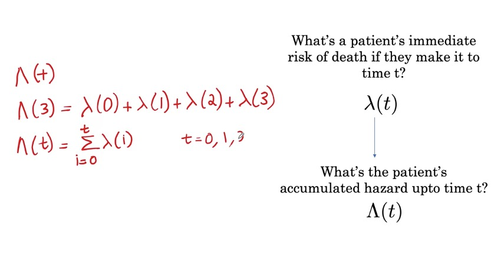
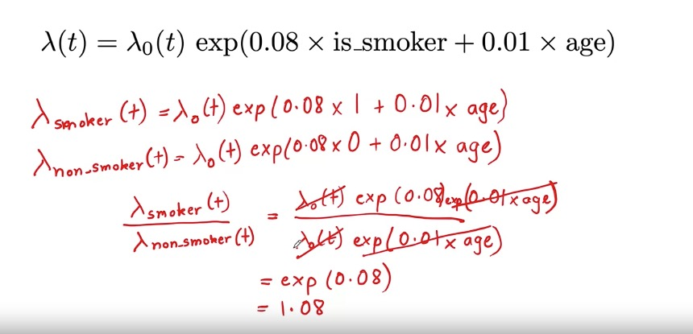
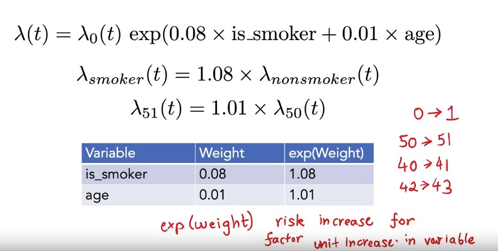
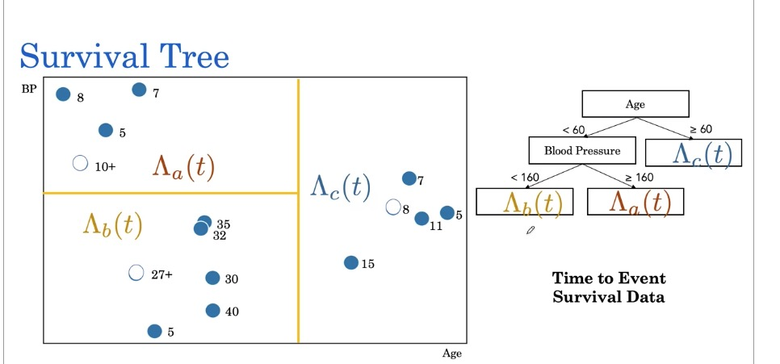

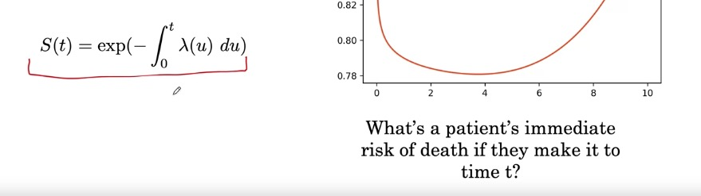
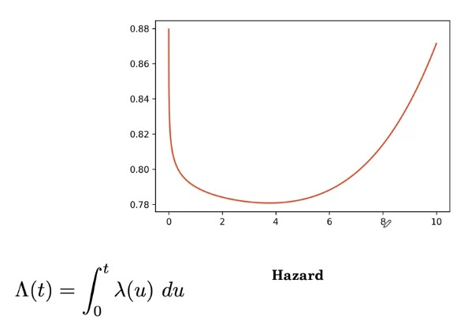
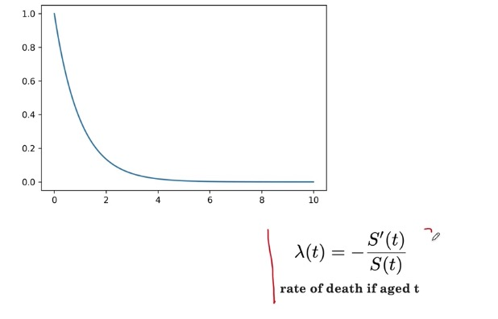
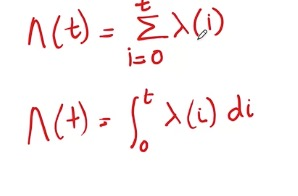
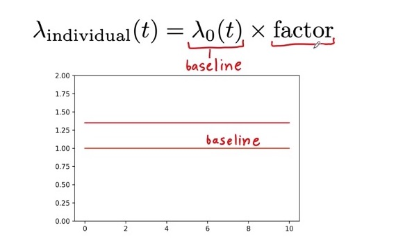


# COURSE 3: MEDICAL TREATMENT

## WEEK 1: MEASURING RISK AND TREATMENT EFFECT

### RISK: AR & ARR

En esta semana veremos tecnicas para predecir el efecto de un tratamiento en un paciente, como de efectivo es.

Para ello, el paradigma siempre es un ensayo clinico:

* Un grupo de pacientes (casos) recibe el tratamiento
* Un grupo no recibe el tratamiento (recibe el tto estandar o placebo).

Tras ello, en ambos grupos medimos el % de pacientes con un evento concreto, que sería el RIESGO ABSOLUTO (AR, absolute risk) de ese evento.
Con estos riesgos absolutos podemos calcular la REDUCCION ABSOLUTA DEL RIESGO (ARR, absolute risk reduction), que es la resta entre los riesgos absolutos de ambos eventos.

Ej: un tto tiene un 5% de infartos y otro un 2% (0.05 y 0.02 de RA). El RAR del nuevo tratamiento será 0.03.

Pero hemos tener en cuenta una cosa MUY IMPORTANTE: la DISTRIBUCIÓN de pacientes (selection-bias), ya que los pacientes de ambas ramas deben ser similares (no puede tener un grupo pacientes jovenes, delgados... y otro ancianos y obesos).

Por ello los pacientes deben ser asignados ALEATORIAMENTE, para que sea un ENSAYO CLÍNICO RANDOMIZADO.


Generalmente, además de ver el efecto (ARR), hemos de ver si ese efecto es estadisticamente significativo (__p-value__), que nos indica la posibilidad de obtener estos resultados por azar, sin que el efdcto estuviera presente.
Este p-value está muy relacionado con el NUMERO DE PACIENTES que participan en el ensayo, ya que a más pacientes, mayor significación estadística.

Podemos calcular el NUMERO NECESARIO A TRATAR de pacientes (NNT), que es (1/ARR), y nos da el numero de pacientes que necesita recibir el tratamiento para beneficiar a uno de ellos (ej: cuantos pacientes habría que tratar con el nuevo tratamiento para evitar el infarto de uno de ellos).

### CAUSAL INFERENCE: ATE (Average Treatment Effect)

Sirve para determinar mediante ML que pacientes se beneficiarán más de un tratamiento (a aquellos a los que más le reducirá el efecto adverso).

Ej: con el tratamiento > no infarto; sin el tratamiento > infarto

Pero tambien puede ocurrir que algunos pacientes tengan un mal outcome (ej: con el tratamiento > infarto y sin el tratamiento > no infarto >> HARM).

Todo esto lo podemos representar con un __modelo causal de Neuman-Rubin__. Representamos:

* yi(1) = el paciente recibe el tratamiento
* yi(0) = el paciente no recibe el tratamiento
* 1 = tiene el evento adverso (ej: infarto)
* 0 = no tiene el evento adverso

Con ello creamos una tabla para cada tratamiento, y luego una tabla con la diferencia entre un tratamiento y otro.
Si tenemos varios pacientes, podemos crear la media para estos pacientes para cada fila:

* Ej: de 5 pacientes con el tratamiento, un media de 40% tienen evento adverso, y de 5 pacientes sin tratamiento, una media del 60% tiene el evento adverso. Por tanto, la diferencia neta sería del -20%, que es el AVERAGE TREATMENT EFFECT (efecto medio del tratamiento).
  

Pero el __PROBLEMA FUNDAMENTAL de la inferencia causal__ corresponde a que, para un evento adverso:

* Si el suceso ocurre, es un evento observado/factual
* Si el suceso no ocurre, se le considera un evento NO OBSERVADO/CONTRAFACTUAL (no se sabe realmente que pasó).

Por tanto, representaremos si el paciente fue tratado con Wi, y con Yi(1) el evento adverso si recibió el tratamiento, y con Yi(0), si no lo recibió (y no sabremos que hubiera pasado si el tratamiento hubiera sido el opuesto: ?)

Por tanto para cada paciente no podemos calcular yi(1) - yi(0) como antes. Ahora, para estimar el ATE (Average treatment effect) si no sabemos las diferencias de resultado para el mismo paciente?

Pues lo podemos inferir SOLO SI SE TRATA DE UN ENSAYO CLINICO RANDOMIZADO. Aqui lo que hacemos será agrupar a los pacientes que tomaron el tratamiento todos juntos (y hacemos la media de eventos adversos), y lo mismo para los que no tomaron el tratamiento. Ahí ya podemos hacer lo mismo que antes, la diferencia entre el efecto de los que reciben el tratamiento y los que no.

Ahí obtenemos el ATE (average traatment effect). Ej: -0.19. Este número está muy relacionado con el ARR (average relative risk), ya que es el opuesto: Si ATE = -0.19, ARR = 0.19 (aumenta el riesgo con el tratamiento).

### CATE (Conditional ATE)

¿COMO CONSEGUIR UNA ESTIMACIÓN MÁS INDIVIDUALIZADA DEL ATE?
Usando el CATE (Condicional ATE), que simplemente es, en ensayos clinicos randomizados, seleccionar pacientes de cada rama que cumplan una determinada condición (ej: edad 56 años), y calcular su ATE igual (con la diferencia).

El problema es CUANDO HAY POCOS PACIENTES, ya que puede ser que no seamos capaces de calcularlo. Más aún cuando no usamos solo una condición, sino que usamos varias (edad, tensión arterial...).

Una posible solución sería CALCULAR LA RELACIÓN entre distintas variables (edad, tensión...), calculando un nuevo valor (mu1 y mu0, uno para cada grupo de tratamiento), y así usarlo para calcular el ATE. El del grupo tratamiento será el _treatment response function_ y el del grupo control será _control response function_.

Estas funciones se calcularán mediante __BASE LEARNERS__, que son modelos (decision trees, linear models...) que reciben como inputs las variables que queremos combinar (edad, tensión...) y el outcome del evento adverso, y así estimaos el efecto de tratamiento (ATE) para cada grupo de pacientes.
Por lo que a la hora de la verdad son modelos pronosticos.

Cuando calculamos un arbol de decisión para cada grupo de tratamiento (con los ATE como resultado de cada rama), estamos usando el _two-tree method_ o __T-Learner__.

En cambio, podemos usar un solo modelo para ambos grupos (en el que incluimos el tipo de tratamiento como input): este se llama _single-tree method_ o __S-Learner__.

El problema que tiene el S-Learner es que puede ocurrir que se deje fuera la variable de tratamiento al crear el arbol de decisión, y por tanto no distinguirá entre el efecto de tratamiento entre ambos grupos a la hora de calcular el ATE.

T-Learner es mejor para esto, su mayor problema es que, al usar la mitad de los datos para cada modelo, puede ser que los modelos creados no sean capaces de captar todas las relaciones entre las caracteristicas de entrada (edad, tensión....) por tener menos datos.

Al calcular este ATE individualizado estamos calculando el ITE (individual treatment efect).


### ITE: INDIVIDUAL TREATMENT EFFECT

A la hora de evaluar estos modelos, tenemos un problema: tenemos un paciente con unas caracteristicas (ej: edad 56, TA 130) con un ITE estimado de -0.33.

Pero cómo podemos evaluar si ese ITE es real, si al paciente no lo podemos tener en las dos ramas a la vez? (no podemos darle el tratamiento y no darselo). Tan solo tendremos un outcome real, pero no conoceremos el otro.

Para ello, una forma de hacerlo es INFERIR el resultado que tendría bajo la otra rama, buscando un paciente similar en la otra rama. Para ello hay dos estrategias:

* Coger un paciente de la otra rama con caracteristicas similares (ej: edad 54, TA 125).
* Coger un paciente de la otra rama con un ITE similar (ej: -0.34)

A estos dos pacientes se les llama __MATCHED PAIR__, y en ellos tendremos tambien un ITE estimado (la media de ambos ITE), y un ITE real (observado).

* Si ese ITE es negativo (-1): BENEFICIO OBSERVADO (observed benefit)
* Si ese ITE es positivo (1): DAÑO OBSERVADO (observed harm)
* Si el ITE es cero (0): SIN EFECTO (observed no effect).

Solo pueden tomar estos tres valores (1, 0, -1) ya que comparamos solo parejas de pacientes.

Este calculo nos sirve para saber si el beneficio predicho se corresponde con el beneficio observado.

### C-FOR-BENEFIT (C-INDEX)

Teniendo en cuenta el resultado OBSERVADO (outcome) y el ESTIMADO (estimate), y tomando parejas de matched pairs (no parejas de individuos), tendremos dos posibilidades:

* CONCORDANT PAIR: lo que cuadra: cuando la pareja con mayor valor estimado es la que tiene mayor valor observado (la pareja que más se iba a beneficiar del tratamiento es la que realmente tiene mejor outcome, y la que predecia daño realmente tiene más daño).
* NON CONCORDANT PAIR: al reves: la que tenia mejor estimación que le iba a ir bien el tratamiento (mejor estimade) resulta tener peor resultado (outcome).
* RISK TIE: cuando dos parejas tienen la misma estimacion (estimate) pero resultados opuestos, lo que nos impide comparar el efecto del tratamiento.
* TIE IN OUTCOME: cuando tienen el mismo outcome, pero distinta estimación, no los podemos comparar ya que no podemos decir cual tiene peor score.

Solo podemos comparar pares que tengan DISTINTOS OUTCOMES, y estos pares se llaman PERMISSIBLE PAIRS (todas las que tienen distintos outcomes entre si).

Para calcular el C-INDEX:

```python
c_index = concordant_pairs + (0.5 * risk_ties) / permissible_pairs
```

Generalmente, para calcularlo se hace un __match by rank__: se ordenan a los dos grupos de tratamiento por ITE (de negativo a positivo), y se matchean uno a uno para crear pares. Y despues se calcula el C-for-Benefit.

¿Que significa el C-index?
Lo que calcula es que, dadas dos parejas al azar (A y B) con diferentes outcomes, cual es la probabilidad de que el par con mayor ITE (estimacion de mayor efecto con el tratamiento), realmente sea el par con mayor outcome (mayor efecto de tratamiento).
Por ej, un C-for-Benefitt de 0.6 quiere decir que la probabilidad del modelo de identificar correctamente la pareja de pacientes con mayor respuesta al tratamiento es del 60%.


## WEEK 2: NLP


