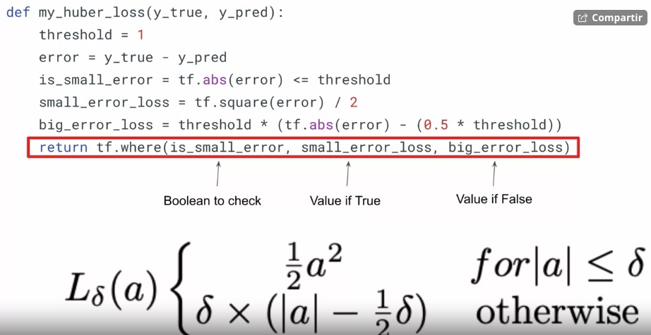
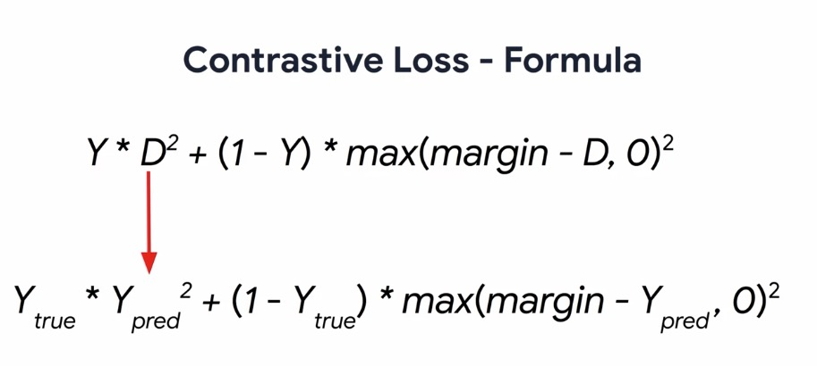
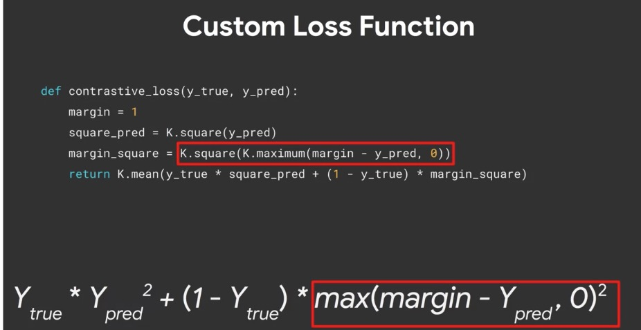
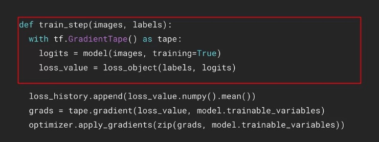
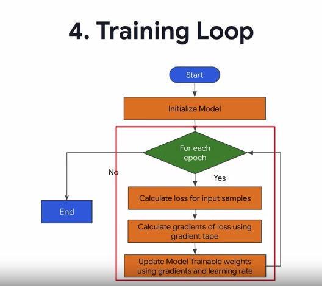
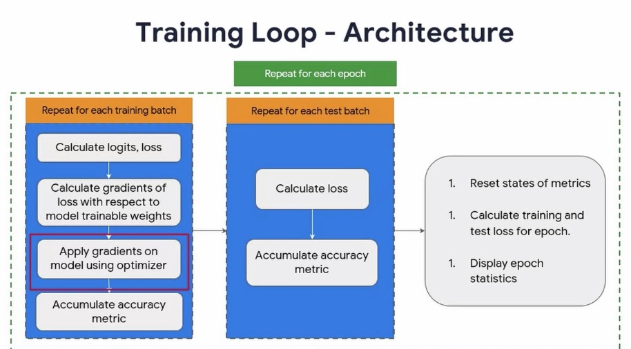
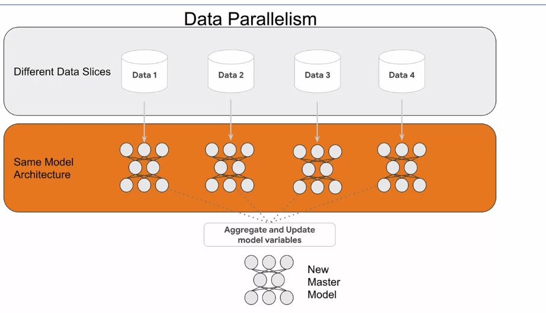
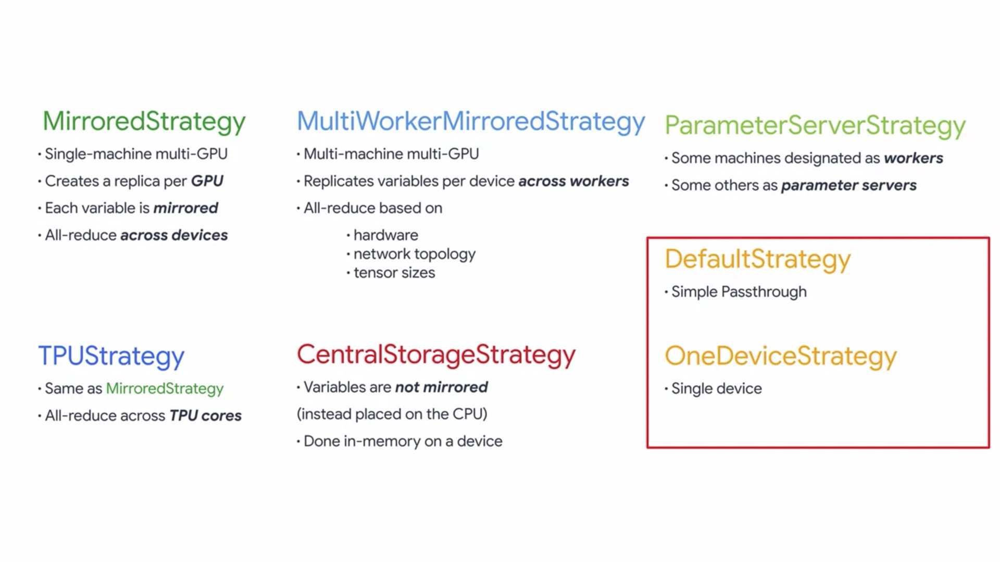
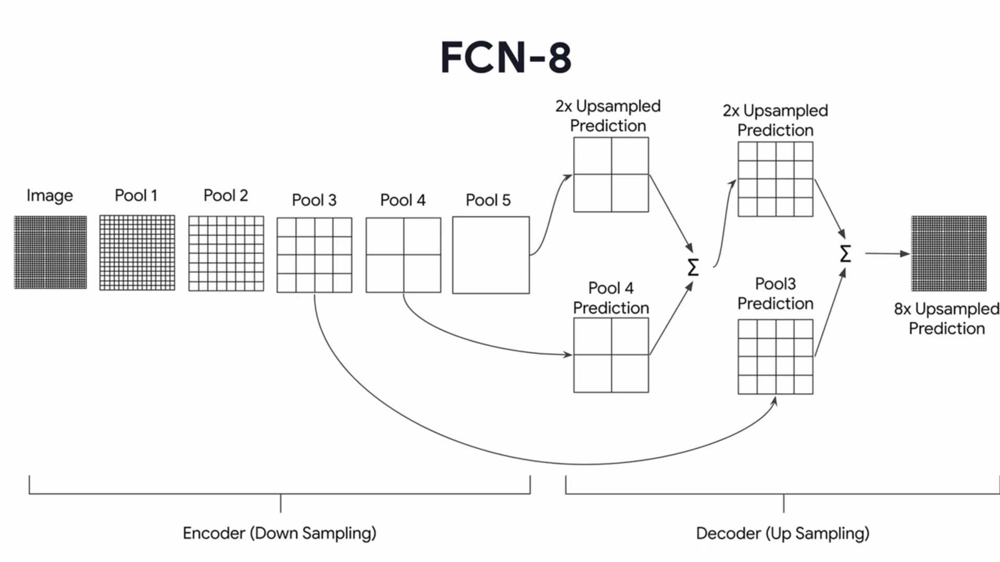
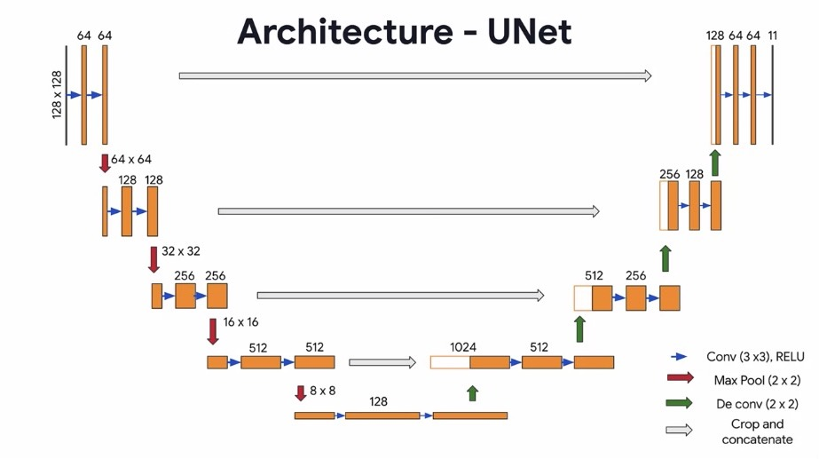

ADVANCED TECHNIQUES IN TENSORFLOW
DEEPLEARNING.AI SPECIALIZATION
DECEMBER 2020

# COURSE 1: CUSTOM MODELING
## WEEK 1: FUNCTIONAL API

### Multioutput models

En los modelos multioutput y multiinput, es necesario usar la Functional API. La diferencia es:

* Tiene un __Input__
* Luego tiene capas intermedias (similar a la sequential API)
* Luego tiene __Model__ en el que se especifican los inputs y outputs.
  * ```model = Model(inputs=input_layer, outputs=[y1_output, y2_output])```

A la hora de compilar, se puede usar un loss y metrics diferente para cada output especificandolo en un __diccionario__.

```python 
model.compile(optimizer=optimizer,
              loss={'y1_output': 'mse', 'y2_output': 'mse'},
              metrics={'y1_output': tf.keras.metrics.RootMeanSquaredError(),
                       'y2_output': tf.keras.metrics.RootMeanSquaredError()})
```


Esto es parecido a lo que se hizo en (Inception)[https://towardsdatascience.com/a-simple-guide-to-the-versions-of-the-inception-network-7fc52b863202]

### Multi-input models

El tipico ejemplo son los __SIAMESE__ networks, que se usan para predecir similaridad entre dos imágenes (que pasan ambas por un mismo modelo y separado que despues se une y se entrena para calcular similaridad).

Generalmente en este tipo de modelos tendremos:

* Un modelo base *base_network* en el que pasaremos las dos imagenes por separado (con su input y output, se usa como una funcion).
* Una salida conjunta al modelo, que generalmente será una funcion de similaridad (como *euclidean distance*), enrollada en una __Lambda layer__. A ella se le pasan como argumentos los dos modelos anteriores separados:
* Generalmente también se usa un _custom loss_, como el contrastive loss with margin.

```python
def euclidean_distance(vects):
    x, y = vects
    sum_square = K.sum(K.square(x - y), axis=1, keepdims=True)
    return K.sqrt(K.maximum(sum_square, K.epsilon()))


def eucl_dist_output_shape(shapes):
    shape1, shape2 = shapes
    return (shape1[0], 1)

vect_output_a = base_network(input_a)
vect_output_b = base_network(input_b)
output = Lambda(euclidean_distance, name="output_layer", output_shape=eucl_dist_output_shape)([vect_output_a, vect_output_b])

# specify the inputs and output of the model
model = Model([input_a, input_b], output)

# For reference: contrastive loss with margin
def contrastive_loss_with_margin(margin):
    def contrastive_loss(y_true, y_pred):
        '''Contrastive loss from Hadsell-et-al.'06
        http://yann.lecun.com/exdb/publis/pdf/hadsell-chopra-lecun-06.pdf
        '''
        square_pred = K.square(y_pred)
        margin_square = K.square(K.maximum(margin - y_pred, 0))
        return K.mean(y_true * square_pred + (1 - y_true) * margin_square)
    return contrastive_loss
```

A la hora de entrenar, tendremos que pasar como lista los dos inputs a _model.fit_:

```history = model.fit([tr_pairs[:,0], tr_pairs[:,1]], tr_y, epochs=20, batch_size=128```


### TIPS SEMANA 1:

* Para randomizar los datos (shuffle data): ```df = df.iloc[np.random.permutation(len(df))]```
* Recordar que **.pop** devuelve el valor y lo elimina de la lista (o del lugar donde esté guardado).
* Cuando buscamos los (losses en la documentación)[https://www.tensorflow.org/api_docs/python/tf/keras/losses#functions], debemos buscarlos en funciones, no en clases.

## WEEK 2: CUSTOM LOSS

### Custom Loss Functions
Para implementar un custom loss tan solo hay que crear una funcion que tenga como argumentos `y_true, y_pred`.

```python
def my_huber_loss(y_true, y_pred):
    threshold = 1
    error = y_true - y_pred
    is_small_error = tf.abs(error) <= threshold
    small_error_loss = tf.square(error) / 2
    big_error_loss = threshold * (tf.abs(error) - (0.5 * threshold))
    return tf.where(is_small_error, small_error_loss, big_error_loss)
```

Si quisieramos pasarle __hiperparámetros__, es necesario hacer una __wrapper function__ por encima para encapsular (no directamente):

```python
def my_huber_loss_with_threshold(threshold):
    def my_huber_loss(y_true, y_pred):
        error = y_true - y_pred
        is_small_error = tf.abs(error) <= threshold
        small_error_loss = tf.square(error) / 2
        big_error_loss = threshold * (tf.abs(error) - (0.5 * threshold))
        return tf.where(is_small_error, small_error_loss, big_error_loss)
    return my_huber_loss
```



Luego tan solo hay que especificar esa función cuanto compilemos el modelo:

```python
model.compile(optimizer='sgd', loss=my_huber_loss_with_threshold(threshold=0.9))
```

### Custom Loss Classes

Además de como funciones, también podemos hacerlas como clases que derivan de tf.keras.Loss. Se les llama _Object-Oriented Loss_. Deben tener:

* Una parte __init__ en que se inicializan los parametros que se van a usar
* Una parte __call__ en que se ejecutan las operaciones

El loss a continuación es igual que la función creada antes:

```python
from tensorflow.keras.losses import Loss

class MyHuberLoss(Loss):
  
    # class attribute
    threshold = 1
  
    # initialize instance attributes
    def __init__(self, threshold):
        super().__init__()
        self.threshold = threshold

    # compute loss
    def call(self, y_true, y_pred):
        error = y_true - y_pred
        is_small_error = tf.abs(error) <= self.threshold
        small_error_loss = tf.square(error) / 2
        big_error_loss = self.threshold * (tf.abs(error) - (0.5 * self.threshold))
        return tf.where(is_small_error, small_error_loss, big_error_loss)

model.compile(optimizer='sgd', loss=MyHuberLoss(threshold=1.02))
```

Otro ejemplo de esto es el Contrastive Loss que se usa en las siamese networks; podemos crearlo como función:

```python
def contrastive_loss_with_margin(margin):
    def contrastive_loss(y_true, y_pred):
        '''Contrastive loss from Hadsell-et-al.'06
        http://yann.lecun.com/exdb/publis/pdf/hadsell-chopra-lecun-06.pdf
        '''
        square_pred = K.square(y_pred)
        margin_square = K.square(K.maximum(margin - y_pred, 0))
        return K.mean(y_true * square_pred + (1 - y_true) * margin_square)
    return contrastive_loss
```




O también como clase

```python
class ContrastiveLoss(Loss):
    margin = 0
    def __init__(self, margin):
        super().__init__()
        self.margin = margin

    def call(self, y_true, y_pred):
        square_pred = K.square(y_pred)
        margin_square = K.square(K.maximum(self.margin - y_pred, 0))
        return K.mean(y_true * square_pred + (1 - y_true) * margin_square)
```

## WEEK 3: CUSTOM LAYERS

### Lambda layer

La capa más facil que podemos crear es una _Lambda layer_ que simplemente encapsula código arbitrario (generalmente una funcion).
Deriva de `tf.keras.layers.Lambda(lambda x: tf.function(x))`

### Custom layers

Se basan en heredar de _tf.keras.layers.Layer_. Todas las capas estan formadas por:

* Weights: son variables que asignan el estado de la capa (pesos).
* Computation state: son las formulas-transformaciones que se aplican a los inputs para convertirlos en outputs.

Para crearlos, es necesario establecer tres funciones:

* **__init__** que crea la capa y establece los parametros (de entrada). Aquí siempre debemos heredar de **__super__**.
* **build**, que crea el estado de los pesos. Para ello generalmente usamos como entrada el _input shape_.
* **call**, que usa como entrada los _inputs_ y calcula las transformaciones para devolver la salida.

Podemos ver el estado de los pesos de una capa ejecutando __layer.variables__.

```python
# inherit from this base class
from tensorflow.keras.layers import Layer

class SimpleDense(Layer):

    def __init__(self, units=32):
        '''Initializes the instance attributes'''
        super(SimpleDense, self).__init__()
        self.units = units

    def build(self, input_shape):
        '''Create the state of the layer (weights)'''
        # initialize the weights
        w_init = tf.random_normal_initializer()
        self.w = tf.Variable(name="kernel",
            initial_value=w_init(shape=(input_shape[-1], self.units),
                                 dtype='float32'),
            trainable=True)

        # initialize the biases
        b_init = tf.zeros_initializer()
        self.b = tf.Variable(name="bias",
            initial_value=b_init(shape=(self.units,), dtype='float32'),
            trainable=True)

    def call(self, inputs):
        '''Defines the computation from inputs to outputs'''
        return tf.matmul(inputs, self.w) + self.b
```

### Activation in custom layers

Si queremos añadir un activador (relu...) a nuestra capa, tan solo hay que especificarlo en _init_ y en _call_ (no hay que tocar los pesos):

Por ejemplo, a la anterior habría que añadirle:

```python

class SimpleDense(Layer):
    def __init__(self, units=32, activation=None):
        super(SimpleDense, self).__init__()
        self.units = units
        self.activation = tf.keras.activations.get(activation)

    def build(self, input_shape):
        # se deja igual

    def call(self, inputs):
        return self.activation(tf.matmul(inputs, self.w) + self.b)
```


## WEEK 4: CUSTOM MODELS

### Basic custom models

Además de agrupar un modelo en una función, tambien podemos crearlo como _Clase_, heredando desde _Model_. Para ello debemos definir dos funciones:

* **__init__** que sirve para instanciar los atributos de la clase (en este caso, las capas).
* **call** sirve para construir el modelo  y definir las salidas.


```python
class WideAndDeepModel(Model):
    def __init__(self, units=30, activation='relu', **kwargs):
        '''initializes the instance attributes'''
        super().__init__(**kwargs)
        self.hidden1 = Dense(units, activation=activation)
        self.hidden2 = Dense(units, activation=activation)
        self.main_output = Dense(1)
        self.aux_output = Dense(1)

    def call(self, inputs):
        '''defines the network architecture'''
        input_A, input_B = inputs
        hidden1 = self.hidden1(input_B)
        hidden2 = self.hidden2(hidden1)
        concat = concatenate([input_A, hidden2])
        main_output = self.main_output(concat)
        aux_output = self.aux_output(hidden2)
        
        return main_output, aux_output
```

Como deriva de _Model_, podemos seguir usando:

* Built-in training, evaluation and prediction (model.fit...)
* Saving-serialization (model.save, model.save_weights)
* Summarization, plot (model.summary, tf.keras.utils.plot_model)

La principal limitación de la Functional API es que no es dinámica (no podemos tener redes recurrentes) y con capas conectadas de forma gráfica.

Gracias al subclassing podemos:

* Diseñar una arquitectura modular
* Probar experimentos rápidamente (tan solo )


### Advanced custom models

Podemos usar subclases para crear 'bloques' (se comportan como modelo pero son conjuntos de capas que luego se aplican en otro modelo más grande). Ej.: los bloques en Inception o los identity blocks en las ResNet.

Por ejemplo, primero creamos los __identity blocks__:

```python
class IdentityBlock(tf.keras.Model):
    def __init__(self, filters, kernel_size):
        super(IdentityBlock, self).__init__(name='')

        self.conv1 = tf.keras.layers.Conv2D(filters, kernel_size, padding='same')
        self.bn1 = tf.keras.layers.BatchNormalization()

        self.conv2 = tf.keras.layers.Conv2D(filters, kernel_size, padding='same')
        self.bn2 = tf.keras.layers.BatchNormalization()

        self.act = tf.keras.layers.Activation('relu')
        self.add = tf.keras.layers.Add()  
    
    def call(self, input_tensor):
        x = self.conv1(input_tensor)
        x = self.bn1(x)
        x = self.act(x)

        x = self.conv2(x)
        x = self.bn2(x)
        x = self.act(x)

        x = self.add([x, input_tensor]) # el shortcut se hace con la suma de ambos, NO la concatenación
        x = self.act(x)
        return x
```


Una vez que tenemos hecha nuestra skip connection, podemos crear el modelo ResNet completo usando estos bloques:

```python
class ResNet(tf.keras.Model):
    def __init__(self, num_classes):
        super(ResNet, self).__init__()
        self.conv = tf.keras.layers.Conv2D(64, 7, padding='same')    # estas son las capas iniciales del modelo
        self.bn = tf.keras.layers.BatchNormalization()
        self.act = tf.keras.layers.Activation('relu')
        self.max_pool = tf.keras.layers.MaxPool2D((3, 3))

        # Use the Identity blocks that you just defined             # estos son los identity blocks
        self.id1a = IdentityBlock(64, 3)
        self.id1b = IdentityBlock(64, 3)

        self.global_pool = tf.keras.layers.GlobalAveragePooling2D()     # estas son las capas finales del modelo
        self.classifier = tf.keras.layers.Dense(num_classes, activation='softmax')

    def call(self, inputs):
        x = self.conv(inputs)
        x = self.bn(x)
        x = self.act(x)
        x = self.max_pool(x)

        # insert the identity blocks in the middle of the network
        x = self.id1a(x)
        x = self.id1b(x)

        x = self.global_pool(x)
        return self.classifier(x)
```


Note that _add_ layer is different from _concatenate_ layer. Add is used for skip connections.

### Dinamically-named variables

When we create a class with some atributes, we can access them by using **__dict__**.

```python
# Define a small class MyClass
class MyClass:
    def __init__(self):
        self.var1 = 1

my_obj = MyClass()

my_obj.__dict__
# returns {'var1': 1}
```

For that, we can also use **vars()**, which also can change the state of the attribute using bracket notation:

```python
vars(my_obj)['var3'] = 3

vars(my_obj)
# returns {'var1': 1, 'var3': 3}
```

We can also loop over attribute names to change their value (eg: increment them)

```python
# Use a for loop to increment the index 'i'
for i in range(4,10):
    # Format a string that is var
    vars(my_obj)[f'var{i}'] = 0
```

If we use them inside a Class, we should use _self_:

```python
class MyClass:
    def __init__(self):
        vars(self)['var1'] = 1 # Use vars(self) to access the class's dictionary of variables
```


## WEEK 5: CALLBACKS

Son funciones que permiten controlar el proceso de entrenamiento, que derivan de tf.keras.callbacks.Callback.
Nos permiten entender el estado del modelo durante el entrenamiento (estados internos, estadisticas y metricas durante el entrenamiento...).


### Built-in callbacks 

Algunos de los callbacks por defecto más importantes son:

* Tensorboard: nos permite visualizar modelos, experimentos y metricas en tiempo real.
* ModelCheckpoint: nos guarda el modelo de vez en cuando (cuando se lo digamos). Solo guarda el modelo con mejor puntuación.
* EarlyStopping: para el entrenamiento cuando hay un cambio definido en una metrica (se estanca, empeora...).
* CSVLogger: guarda las metricas y los valores de loss en un csv para hacer tracking.


```python
tensorboard_callback = tf.keras.callbacks.TensorBoard(logdir)
%tensorboard --logdir logs

chkpt_callback = tf.keras.callbacks.ModelCheckpoint('weights.{epoch:02d}-{val_loss:.2f}.h5', verbose=1
stop_callback = tf.keras.callbacks.EarlyStopping(
              patience=3,
              min_delta=0.05,
              baseline=0.8,
              mode='min',
              monitor='val_loss',
              restore_best_weights=True,
              verbose=1)
csv_callback = tf.keras.callbacks.CSVLogger(csv_file)

model.fit(train_batches, 
          epochs=10, 
          validation_data=validation_batches, 
          callbacks=[tensorboard_callback,...])
```

Tambien hay callbacks para modificar la **Learning Rate** conforme avanza el entrenamiento:

```python
def step_decay(epoch):
	initial_lr = 0.01
	drop = 0.5
	epochs_drop = 1
	lr = initial_lr * math.pow(drop, math.floor((1+epoch)/epochs_drop))
	return lr

lr_scheduler = tf.keras.callbacks.LearningRateScheduler(step_decay, verbose=1)

lr_reducer = tf.keras.callbacks.ReduceLROnPlateau(monitor='val_loss', 
                                       factor=0.2, verbose=1,
                                       patience=1, min_lr=0.001)
```

### Custom callbacks

Para crear un custom callback tan solo tenemos que heredar de la subclase tf.keras.callbacks.Callback().


>For training, testing, and predicting, following methods are provided to be overridden.
>#### `on_(train|test|predict)_begin(self, logs=None)`
>Called at the beginning of `fit`/`evaluate`/`predict`.
>#### `on_(train|test|predict)_end(self, logs=None)`
>Called at the end of `fit`/`evaluate`/`predict`.
>#### `on_(train|test|predict)_batch_begin(self, batch, logs=None)`
>Called right before processing a batch during training/testing/predicting. Within this method, `logs` is a dict with `batch` and `size` available keys, representing the current batch number and the size of the batch.
>#### `on_(train|test|predict)_batch_end(self, batch, logs=None)`
>Called at the end of training/testing/predicting a batch. Within this method, `logs` is a dict containing the stateful metrics result.

>### Training specific methods
>In addition, for training, following are provided.
>#### `on_epoch_begin(self, epoch, logs=None)`
>Called at the beginning of an epoch during training.
>#### `on_epoch_end(self, epoch, logs=None)`
>Called at the end of an epoch during training.

Ejemplos:

Callback para imprimir el tiempo en que empieza y acaba cada batch

```python
class PrintTime(tf.keras.callbacks.Callback):

    def on_train_batch_begin(self, batch, logs=None):
        print('Training: batch {} begins at {}'.format(batch, datetime.datetime.now().time()))

    def on_train_batch_end(self, batch, logs=None):
        print('Training: batch {} ends at {}'.format(batch, datetime.datetime.now().time()))
```

Cada epoch se nos devuelve el valor de los **epochs** y un diccionario de **logs**, que contiene el loss y las metricas. Esto lo podemos usar en los callbacks:

```python
# este callback imprime el ratio train-val loss en cada epoch
callback = tf.keras.callbacks.LambdaCallback(
    on_epoch_end=lambda epoch,logs: 
    print("Epoch: {}, Val/Train loss ratio: {:.2f}".format(epoch, logs["val_loss"] / logs["loss"]))
)
```

Si queremos pasarle parámetros, debemos hacerlo en init. Por ejemplo en este callback que para el entrenamiento si detecta overfitting (ratio train-val loss demasiado alto):

```python
class DetectOverfittingCallback(tf.keras.callbacks.Callback):
    def __init__(self, threshold=0.7):
        super(DetectOverfittingCallback, self).__init__()
        self.threshold = threshold # aqui es donde hay que añadirselo; el resto no hace falta inicializarlos

    def on_epoch_end(self, epoch, logs=None):
        ratio = logs["val_loss"] / logs["loss"]
        print("Epoch: {}, Val/Train loss ratio: {:.2f}".format(epoch, ratio))

        if ratio > self.threshold:
            print("Stopping training...")
            self.model.stop_training = True     # así es como podemos parar el entrenamiento
```

También podemos hacer callbacks para visualizar predicciones. Por ejemplo este usa la función display_digits (creada anteriormente), y, cada x epochs (en este caso 10), toma una muestra de digitos y muestra la imagen real, la label real  y la label predicha y muestra si se ha equivocado o no. Al final hace hasta un gif.

```python
class VisCallback(tf.keras.callbacks.Callback):
    def __init__(self, inputs, ground_truth, display_freq=10, n_samples=10):
        self.inputs = inputs
        self.ground_truth = ground_truth
        self.images = []
        self.display_freq = display_freq
        self.n_samples = n_samples

    def on_epoch_end(self, epoch, logs=None):
        # Randomly sample data
        indexes = np.random.choice(len(self.inputs), size=self.n_samples)
        X_test, y_test = self.inputs[indexes], self.ground_truth[indexes]
        predictions = np.argmax(self.model.predict(X_test), axis=1)

        # Plot the digits
        display_digits(X_test, predictions, y_test, epoch, n=self.display_freq)

        # Save the figure
        buf = io.BytesIO()
        plt.savefig(buf, format='png')
        buf.seek(0)
        image = Image.open(buf)
        self.images.append(np.array(image))

        # Display the digits every 'display_freq' number of epochs
        if epoch % self.display_freq == 0:
            plt.show()

    def on_train_end(self, logs=None):
        imageio.mimsave(GIF_PATH, self.images, fps=1)
```


# COURSE 2: CUSTOM TRAINING
## WEEK 1: GRADIENT TAPE

### Tensors

Los tensores son estructuras flexibles que almacenan datos. En función de su dimensionalidad:

* Scalar: sin dimensiones (10)
* Vector: dimension 1 (1, 2, 3)
* Matrix: dimension 2 ([1, 2, 3], [4, 5, 6], [7, 8, 9])
* Pueden tener muchas más dimensiones.

En tensorflow, hay dos tipos: _tf.Constant_ que no se puede modificar, y _tf.Variable_ que se puede modificar.

Al crear un tensor, se crea con _tf.Tensor_ especificando el _shape_ y el _data type_:

```python
tensor = tf.Variable(initial_value = , shape =(2,2) , dtype = tf.int32)
```

Cosas a tener en cuenta:

* Un tensor puede contener un valor de String
* Un tf.variable NO puede convertir la estructura de los datos en funcion del dtype (si le pasamos [1, 2, 3, 4, 5, 6] no podemos poner dtype (2, 2) sino (4,)); en cambio en un tf.constant si podemos
* En una tf.constant tambien podemos hacer broadcast: si establecemos un valor unico (-1) y un shape, todos los valores se estableceran al mismo

Si tenemos un modelo y usamos _model.variables_, obtenemos los valores de los tensores que contiene (w, b...)

#### Operaciones que se pueden hacer con tf: 

* tf.add, tf.substract, tf.multiply, tf.square
* __tf.reduce_sum__ (que lo que hace es sumar todos los valores de una dimension para obtener un escalar: ej, de 1 2 3 obtenemos 6)
* tf.reshape(x, (newshape1, newshape2)): para cambiar la forma del tensor
* tf.cast(x, dtype=tf.float32): para convertir un tipo de archivo en otro
* tensor.numpy(): sirve para obtener el valor de un tensor convertido en un numpy array

### GradientTape

Sirve para ejecutar directamente el training loop y calcular las derivadas de los gradientes para actualizar nosotros los parámetros. Básicamente el orden que usaremos será:

Para cada ejemplo de cada batch:
    1- Calcular el forward pass
    2- Calcular el loss
    3- Añadirlo al histórico de losses
4- Calcular las derivadas del loss respecto a los parametros
5- Actualizar los parametros con las derivadas

```python
x = tf.ones((2,2))

with tf.GradientTape() as tape:
    # Esto no siempre hace falta, es simplemente para saber que es lo que hay que fijar
    tape.watch(x) 

    # Make prediction
    pred_y = w * real_x + b

    # Calculate loss
    reg_loss = simple_loss(real_y, pred_y)

# Calculate gradients
w_gradient = tape.gradient(reg_loss, w)
b_gradient = tape.gradient(reg_loss, b)

# Update variables
w.assign_sub(w_gradient * LEARNING_RATE)
b.assign_sub(b_gradient * LEARNING_RATE)
```

O lo que es lo mismo (pero bien definido):




Si al llamar al tape usamos __persistent=True__, podremos usarlo para calcular varios gradientes a la vez (sino, por defecto se extingue después de un uso). Para eliminarlo, usaremos `del t`:

```python
with tf.GradientTape(persistent=True) as t:
    ...
dz_dx = t.gradient(z, x)
dy_dx = t.gradient(y, x)  # ahora ya no dará error
del t
```

## WEEK 2: CUSTOM TRAINING LOOP

### Steps to replace training loop

Normalmente _model.compile_ y _model.fit_ se encargan del training loop, pero lo podemos reemplazar completamente y hacer el entrenamiento nosotros. Para ello los pasos son:

1. Definir el modelo
2. Preparar el training data
3. Definir el loss y el optimizador (y las metricas)
4. Entrenar el modelo con inputs mediante minimizar el loss con el optimizador
5. Validar el modelo

```python
def train(model, inputs, outputs, learning_rate):
  with tf.GradientTape() as t:
    current_loss = loss(model(inputs), outputs)
  dw, db = t.gradient(current_loss, [model.w, model.b])
  model.w.assign_sub(learning_rate * dw)
  model.b.assign_sub(learning_rate * db)

  return current_loss

# Instanciate model
model = Model()

# Collect the history of W-values and b-values to plot later
list_w, list_b = [], []
epochs = range(15)
losses = []

# Training loop
for epoch in epochs:
  list_w.append(model.w.numpy())
  list_b.append(model.b.numpy())
  current_loss = train(model, xs, ys, learning_rate=0.1)
  losses.append(current_loss)
  print('Epoch %2d: w=%1.2f b=%1.2f, loss=%2.5f' %
        (epoch, list_w[-1], list_b[-1], current_loss))

```

### Losses and Metrics

Generalmente los usaremos directamente de tf.keras.losses y tf.keras.metrics, de donde los podemos tomar tanto como función como como clase.

Con las metricas podemos usar tres métodos:

1. **metric.update_state()** to accumulate metric statistics after each bach
2. **metric.result** to get current value of metric for display
3. **metric.reset_state()** to reset metric value typically at end of epoch

Nota: SparseCategoricalCrossentropy se usa cuando los labels son integers y no one-hot encoded.

### Training loop




El cuaderno de esta semana (C2W2Lab2) es muy util para hacer un custom training loop, siguiendo los pasos que hemos visto al principio.

**1- Crear el modelo**
**2- Preprocesar los datos de entrada**

Generalmente, con imágenes esto implica normalizar de 0-1 y a veces eliminar la dimension (flatten, de 28x28 a 784):

```python
def format_image(data):        
    image = data["image"]
    image = tf.reshape(image, [-1]) # esto hace flatten
    image = tf.cast(image, 'float32') # esto convierte a floar
    image = image / 255.0 # esto normaliza
    return image, data["label"]

train_data = train_data.map(format_image)
test_data = test_data.map(format_image)
```

Además, generalmente también hemos de establecer los batches y, si es necesario, cargarlos en memoria:

```python
batch_size = 64
train = train_data.shuffle(buffer_size=1024).batch(batch_size)
test =  test_data.batch(batch_size=batch_size)
```

**3- Definir el loss, optimizador y metricas**
**4- Crear el training loop**

El training loop son una serie de pasos que se repiten por cada epoch (pasada completa al df):
* Para training data, utilizar los _batches_ y realizar el entrenamiento para cada batch:
  * Pasar los datos del minibatch al modelo y calcular las prediciones (**logits**); y calcular el loss entre la realidad y las predicciones (*y_true, y_pred* o *labels, logits*)
  * Calcular el gradiente entre el loss y los parametros entrenables por el modelo
  * Aplicarle el optimizador para modificar el valor de los parametros
  * Al final de **cada step** obtenemos las predicciones (logits) y el loss, y con ello hacemos track del valor del loss y calculamos las _training metrics_
  * Además, al final de **cada epoch** calculamos el training loss y metrics del epoch.
* En validación, simplemente se calcula el loss (_validation loss_) y las _validation metrics_ para TODO el epoch (pasando el validation data por el modelo).

    From coursera:
    Perform training over all batches of training data.
    Get values of metrics.
    Perform validation to calculate loss and update validation metrics on test data.
    Reset the metrics at the end of epoch.
    Display statistics at the end of each epoch.


Aqui tenemos las funciones auxiliares para llamarlas después en el training loop:

```python
def apply_gradient(optimizer, model, x, y):
  with tf.GradientTape() as tape:
    logits = model(x) # logits ==  predictions
    loss_value = loss_object(y_true=y, y_pred=logits)
  
  gradients = tape.gradient(loss_value, model.trainable_weights)
  optimizer.apply_gradients(zip(gradients, model.trainable_weights))
  
  return logits, loss_value

def train_data_for_one_epoch():
  losses = []
  pbar = tqdm(total=len(list(enumerate(train))), position=0, leave=True, bar_format='{l_bar}{bar}| {n_fmt}/{total_fmt} ')
  for step, (x_batch_train, y_batch_train) in enumerate(train):
      logits, loss_value = apply_gradient(optimizer, model, x_batch_train, y_batch_train)
      
      losses.append(loss_value)
      
      train_acc_metric(y_batch_train, logits)
      pbar.set_description("Training loss for step %s: %.4f" % (int(step), float(loss_value)))
      pbar.update()
  return losses

def perform_validation():
  losses = []
  for x_val, y_val in test:
      val_logits = model(x_val)
      val_loss = loss_object(y_true=y_val, y_pred=val_logits)
      losses.append(val_loss)
      val_acc_metric(y_val, val_logits)
  return losses

```

Y a la hora de ejecutar el training loop llamamos a estas funciones:

```python
model = base_model()

# Iterate over epochs.
epochs = 10
epochs_val_losses, epochs_train_losses = [], []
for epoch in range(epochs):
  print('Start of epoch %d' % (epoch,))
  
  losses_train = train_data_for_one_epoch()
  train_acc = train_acc_metric.result()

  losses_val = perform_validation()
  val_acc = val_acc_metric.result()

  losses_train_mean = np.mean(losses_train)
  losses_val_mean = np.mean(losses_val)
  epochs_val_losses.append(losses_val_mean)
  epochs_train_losses.append(losses_train_mean)

  print('\n Epoch %s: Train loss: %.4f  Validation Loss: %.4f, Train Accuracy: %.4f, Validation Accuracy %.4f' % (epoch, float(losses_train_mean), float(losses_val_mean), float(train_acc), float(val_acc)))
  
  train_acc_metric.reset_states()
  val_acc_metric.reset_states()
```


Other useful code:

Plot confusion matrix with sklearn:

```python
def plot_confusion_matrix(y_true, y_pred, title='', labels=[0,1]):
    
    cm = confusion_matrix(y_true, y_pred)
    fig = plt.figure()
    ax = fig.add_subplot(111)
    cax = ax.matshow(cm)
    plt.title(title)
    fig.colorbar(cax)
    ax.set_xticklabels([''] + labels)
    ax.set_yticklabels([''] + labels)
    plt.xlabel('Predicted')
    plt.ylabel('True')
    fmt = 'd'
    thresh = cm.max() / 2.
    for i, j in itertools.product(range(cm.shape[0]), range(cm.shape[1])):
          plt.text(j, i, format(cm[i, j], fmt),
                  horizontalalignment="center",
                  color="black" if cm[i, j] > thresh else "white")
    plt.show()
```

Custom F1-score code:

```python
class F1Score(tf.keras.metrics.Metric):

    def __init__(self, name='f1_score', **kwargs):
        '''initializes attributes of the class'''
        
        # call the parent class init
        super(F1Score, self).__init__(name=name, **kwargs)

        # Initialize Required variables
        # true positives
        self.tp = tf.Variable(0, dtype = 'int32')
        # false positives
        self.fp = tf.Variable(0, dtype = 'int32')
        # true negatives
        self.tn = tf.Variable(0, dtype = 'int32')
        # false negatives
        self.fn = tf.Variable(0, dtype = 'int32')

    def update_state(self, y_true, y_pred, sample_weight=None):
        '''
        Accumulates statistics for the metric
        
        Args:
            y_true: target values from the test data
            y_pred: predicted values by the model
        '''

        # Calulcate confusion matrix.
        conf_matrix = tf.math.confusion_matrix(y_true, y_pred, num_classes=2)
        
        # Update values of true positives, true negatives, false positives and false negatives from confusion matrix.
        self.tn.assign_add(conf_matrix[0][0])
        self.tp.assign_add(conf_matrix[1][1])
        self.fp.assign_add(conf_matrix[0][1])
        self.fn.assign_add(conf_matrix[1][0])

    def result(self):
        '''Computes and returns the metric value tensor.'''

        # Calculate precision
        if (self.tp + self.fp == 0):
            precision = 1.0
        else:
            precision = self.tp / (self.tp + self.fp)
      
        # Calculate recall
        if (self.tp + self.fn == 0):
            recall = 1.0
        else:
            recall = self.tp / (self.tp + self.fn)

        # Return F1 Score
        ### START CODE HERE ###
        f1_score = 2 * ((precision * recall) / (precision + recall))
        ### END CODE HERE ###
        
        return f1_score

    def reset_states(self):
        '''Resets all of the metric state variables.'''
        
        # The state of the metric will be reset at the start of each epoch.
        self.tp.assign(0)
        self.tn.assign(0) 
        self.fp.assign(0)
        self.fn.assign(0)
```


En binary classification, con las predicciones en cada batch hay que hacer esto para las metricas:

```python
        #Round off logits to nearest integer and cast to integer for calulating metrics
        logits = tf.round(logits)
        logits = tf.cast(logits, 'int64')

# o lo que es lo mismo (en val)
        #Round off and cast outputs to either  or 1
        val_logits = tf.cast(tf.round(model(x_val)), 'int64')
```

## WEEK 3: GRAPH MODE

### AUTOGRAPH

Autograph es una herramienta de tf que convierte el código pythonic en código de grafos que es el que tf necesita para paralelizar y acelerar. Para comprobar que es lo que está haciendo, podemos investigar con `print(tf.autograph.to_code(funcion.python_function))`

Para ello debemos añadir el decorador `@tf.function` al inicio. Podemos usarlo tanto en funciones creadas por nosotros como en clases heredadas de keras.

Un ejemplo:

```python
@tf.function
def f(x):
    if x>0:
        x = x * x
    return x

print(tf.autograph.to_code(f.python_function))
```

Es importante a la hora de ejecutar grafos, verificar que el ORDEN de las instrucciones es el que queremos (suma, multiplicación...) para no tener errores a la hora de ejecutarlo.
Si creamos alguna función que vayamos a ejecutar en grafo, es mejor usar `tf.print` que está diseñada para grafos, ya que `print` de python puede tener errores (y solo se imprime una vez cuando hacemos loops en vez de varias veces).
También hay que tener cuidado con la creación de variables locales dentro de la función, ya que a veces pueden provocar un error en el autograph. Es mejor crearlas fuera de la función y llamarlas desde dentro.

## WEEK 4: DISTRIBUTED STRATEGY

Sirve para entrenar un modelo en distintos lugares (GPU, TPU, CPU...) al mismo tiempo aprovechando la potencia combinada. Se hace gracias a la clase `tf.distribute.Strategy`. Debemos conocer los distintos elementos que existen:

* **Device**: cada uno de los dispositivos que puede entrenar (gpu, tpu...)
* **Replica**: son copias del modelo en el que estamos trabajando que se distribuyen en las distintos devices
* **Worker**:  software que corre en el device que se dedica a entrenar la replica en ese device (similar a decir 'máquina').
* **Mirrored variables**: son variables que están en sincronizacion entre los distintos dispositivos (ya que es necesario para el training).

Hay distintos tipos de estrategias de clasificación:

* Dependientes del hardware:
  * Single-machine multi-device: varios devices en una máquina
  * Multi-machine: varias máquinas (con uno o varios devices)

* Según el tipo de entrenamiento:
  * Síncrono: todas entrenan el mismo modelo con distintos datos, y agregan gradientes al final de cada paso que se reducen con all-reduce algorithm. El más usado.
  * Asíncrono: todos los workers son independientes y cambian el entrenamiento en un parameter server.

Los tipos que soporta tf más usados son:




### MIRRORED Strategy

Para acomodar el entrenamiento, hay que cambiar el codigo en dos partes:

* Data preprocessing: es necesario establecer el batch size CONJUNTO para las replicas (multiplicando el bs por el numero de replicas total)
* Model declaration: hay que establecer al crear el modelo que sea dentro del espacio (scope) de la estrategia definida.
  * No es necesario que _model.compile_ ni _model.fit_ estén dentro del scope


```python
strategy = tf.distribute.MirroredStrategy()

print(f'Number of devices: {strategy.num_replicas_in_sync}')

# batch size = 64
batch_size_per_replica = 64
batch_size = batch_size_per_replica * strategy.num_replicas_in_sync

with strategy.scope():
    model = tf.keras.Sequential...

model.compile(...)
```

Con esto se crea una replica para cada device, y las variables se sincronizan (y se tratan como MirroredVariable) y se sincronizan entre si (gracias al algoritmo de nvidia nccl).

### MULTIPLE GPU Mirrored Strategy

En este caso, hay varios cambios que tenemos que hacer:

* Lo primero es convertir el train-test dataset a un dataset distribuido: `train_dist_dataset = strategy.experimental_distribute_dataset(train_dataset)`.
* En el training loop hay que usar este dataset disttribuido; y además hay que hacer usar un training step distribuido (propio): `distributed_train_step(batch)`.
  * Esta función llamará posteriormente a `train_step`, que se verá más adelante. Cn ella conseguiremos los losses per replica y devolveremos una suma reducida de estos losses.
* Posteriormente hay que ponderar, dividiendo el _training loss_ por el _num batches_.

El código está a continuación. La parte importante es *distributed_train-test_step*, ya que es la única que tiene que ver con la distribución (la otra es igual que si fuera solo una GPU).

```python
# `run` replicates the provided computation and runs it
# with the distributed input.
@tf.function
def distributed_train_step(dataset_inputs):
  per_replica_losses = strategy.run(train_step, args=(dataset_inputs,))
  #tf.print(per_replica_losses.values)
  return strategy.reduce(tf.distribute.ReduceOp.SUM, per_replica_losses, axis=None)

def train_step(inputs):
  images, labels = inputs
  with tf.GradientTape() as tape:
    predictions = model(images, training=True)
    loss = compute_loss(labels, predictions)

  gradients = tape.gradient(loss, model.trainable_variables)
  optimizer.apply_gradients(zip(gradients, model.trainable_variables))

  train_accuracy.update_state(labels, predictions)
  return loss

#######################
# Test Steps Functions
#######################
@tf.function
def distributed_test_step(dataset_inputs):
  return strategy.run(test_step, args=(dataset_inputs,))

def test_step(inputs):
  images, labels = inputs

  predictions = model(images, training=False)
  t_loss = loss_object(labels, predictions)

  test_loss.update_state(t_loss)
  test_accuracy.update_state(labels, predictions)
```

Y ahora para entrenar hacemos el training loop usando esas funciones:

```python
EPOCHS = 10
for epoch in range(EPOCHS):
  # Do Training
  total_loss = 0.0
  num_batches = 0
  for batch in train_dist_dataset:
    total_loss += distributed_train_step(batch)
    num_batches += 1
  train_loss = total_loss / num_batches

  # Do Testing
  for batch in test_dist_dataset:
    distributed_test_step(batch)

  template = ("Epoch {}, Loss: {}, Accuracy: {}, Test Loss: {}, " "Test Accuracy: {}")

  print (template.format(epoch+1, train_loss, train_accuracy.result()*100, test_loss.result(), test_accuracy.result()*100))

  test_loss.reset_states()
  train_accuracy.reset_states()
  test_accuracy.reset_states()
```


Cosas a tener en cuenta:

* Si nuestra GPU tiene menos de 4 cores: `os.environ["TF_MIN_GPU_MULTIPROCESSOR_COUNT"] = "4"`
* Si las GPU que vamos a usar son distintas: `strategy = tf.distribute.MirroredStrategy(cross_device_ops=tf.distribute.HierarchicalCopyAllReduce())`
* Si usamos un loss ya creado, debemos tener en cuenta que no haga la reducción por defecto: `loss_object = tf.keras.losses.SparseCategoricalCrossentropy(from_logits=True, reduction=tf.keras.losses.Reduction.NONE)`

### TPU Strategy

Generalmente los usaremos en Colab, ya que se usan solo en google.

Iniciaremos con este código que será el que inicie la TPU y establezca la estrategia:

```python
# Detect hardware
try:
  tpu_address = 'grpc://' + os.environ['COLAB_TPU_ADDR']
  tpu = tf.distribute.cluster_resolver.TPUClusterResolver(tpu_address) # TPU detection
  tf.config.experimental_connect_to_cluster(tpu)
  tf.tpu.experimental.initialize_tpu_system(tpu)
  strategy = tf.distribute.experimental.TPUStrategy(tpu) 
  # Going back and forth between TPU and host is expensive.
  # Better to run 128 batches on the TPU before reporting back.
  print('Running on TPU ', tpu.cluster_spec().as_dict()['worker'])  
  print("Number of accelerators: ", strategy.num_replicas_in_sync)
except ValueError:
  print('TPU failed to initialize.')
```

* Es necesario un custom training loop (no keras.fit)
* Llamar a la funcion distribuida dentro del loop: llamar a strategy.run para entrenar en cada replica y obtener per-replica-losses, y usar strategy.reduce para reducir los losses.
* Para el testing lo mismo, se llama a la funcion de test dentro del loop y a strategy.run

```python
  @tf.function
  def distributed_train_step(dataset_inputs):
    per_replica_losses = strategy.run(train_step,args=(dataset_inputs,))
    print(per_replica_losses)
    return strategy.reduce(tf.distribute.ReduceOp.SUM, per_replica_losses,
                           axis=None)
 
  @tf.function
  def distributed_test_step(dataset_inputs):
    strategy.run(test_step, args=(dataset_inputs,))
```

### OTHER Distribution Strategies

#### OneDeviceStrategy

Sigue siendo un solo dispositivo pero se beneficia de seguir utilizando un dataset distribuido: `strategy = tf.distribute.OneDeviceStrategy(device='gpu:0')`

#### MultiWorkerMirroredStrategy

Cuando hay muchas gpu pero en MUCHAS maquinas. `strategy = tf.distribute.experimental.MultiWorkerMirroredStrategy()`. Más info [en la documentacion de keras](https://www.tensorflow.org/tutorials/distribute/multi_worker_with_keras)

* Es dificil de hacer.
* Las variables se replican en cada device de cada equipo
* Es necesario hacer tolerancia a fallos con tf.keras.callbacks.ModelCheckpoint
* La sincronización se hace con CollectiveOps
* Es necesario definir la **Cluster Specification** en que se define el rol de cada uno de los workers (principal, comprobación...)

#### Others

* **CentralStorageStrategy**:
  * Variables: not mirrored but placed on CPU
  * Computation: replicated across local GPUs

* **ParameterServerStrategy**: some machines are designated as workers, and others as parameter servers (combina lo mejor de CentralStorageStrategy y MultiWorkerStrategy)
  * Variables: placed on one parameter server (ps)
  * Computation: replicated across GPUs of all workers

# COURSE 3: ADVANCED COMPUTER VISION

## WEEK 1: BASICS

Lo primero en computer vision es distinguir:

* Multiclass classification: clasificación excluyente (uno u otro) entre varias clases (>2; si 2 clases: binary). Ej.: perro vs gato
* Multilabel classificacion: clases no excluyentes en una imagen (puede haber varias.. Ej.: hombre con un sombrero

Es la multilabel classification la que permite que haya varios objetos en una misma imagen, y por tanto la que permite la detección de dónde estan dichos objetos (localización) además de la clasificación.

La segmentación actúa en forma de pixel: cada pixel se identifica a un objeto. Existen dos formas:

* Semantic segmentation: semántica, se mueve por el contexto (meaning); todos los objetos con el mismo significado se tratan como el mismo. Ej.: un grupo de personas.
  * Mask R-CNN.
* Instance segmentation: por objetos; cada uno se trata invidualmente (ej: cada persona).


Las redes de imágenes (redes convolucionales) se suelen beneficiar del transfer learning, ya que ahorra tiempo y requiere menos datos de entrenamiento. Consiste básicamente en copiar las capas iniciales de un modelo (y sus pesos) que son las que realizan feature extraction (sobre todo lss iniciales, de low-level features).
Los distintos metodos para entrenar redes con transfer learning son:

* Congelar pesos de las primeras capas (de las capas preentrenadas) y entrenar solo las ultimas capas. Muy util cuando hay poco datos para entrenar.
* No congelar pesos, y entrenar pero usando los pesos preentrenados: generalmente ahorra tiempo con respecto a entrenarlo de cero.

Generalmente hay poco código que cambiar con transfer learning:

```python
# Instantiate the model
pre_trained_model = InceptionV3(input_shape=(150, 150, 3),
                                include_top=False,
                                weights=None)

# load pre-trained weights
pre_trained_model.load_weights(weights_file)

# freeze the layers
for layer in pre_trained_model.layers:
    layer.trainable = False

# pre_trained_model.summary()

last_layer = pre_trained_model.get_layer('mixed7')
print('last layer output shape: ', last_layer.output_shape)
last_output = last_layer.output

# add rest of layers
model = Model(pre_trained_model.input, x)
```

Es mejor mantener el tamaño de entrada de los modelos preentrenados; si hay que cambiar el tamaño (por ejemplo hacer una imagen más grande) mejor usar primero una capa que se llama **UpSampling2D**.

### OBJECT DETECTION

En object detection, al contrario que en classification, tendremos dos outputs:

* Uno para predecir el tipo (softmax)
* Uno para predecir la bounding box (regression)

Para ello hace falta que la entrada sea tambien igual.

Además, para evaluar la calidad de la segmentación se utiliza una métrica que es **IoU** o intersection-over-union, que es una relación entre 0-1 que nos dice el porcentaje de solapamiento entre la predición y la realidad. A más cerca de uno, mejor solapamiento.

IoU = intersección (área de solapamiento) / union (área total)

```python
# Código para IoU
def intersection_over_union(pred_box, true_box):

    xmin_pred, ymin_pred, xmax_pred, ymax_pred =  np.split(pred_box, 4, axis = 1)
    xmin_true, ymin_true, xmax_true, ymax_true = np.split(true_box, 4, axis = 1)

    #Calculate coordinates of overlap area between boxes
    xmin_overlap = np.maximum(xmin_pred, xmin_true)
    xmax_overlap = np.minimum(xmax_pred, xmax_true)
    ymin_overlap = np.maximum(ymin_pred, ymin_true)
    ymax_overlap = np.minimum(ymax_pred, ymax_true)

    #Calculates area of true and predicted boxes
    pred_box_area = (xmax_pred - xmin_pred) * (ymax_pred - ymin_pred)
    true_box_area = (xmax_true - xmin_true) * (ymax_true - ymin_true)

    #Calculates overlap area and union area.
    overlap_area = np.maximum((xmax_overlap - xmin_overlap),0)  * np.maximum((ymax_overlap - ymin_overlap), 0)
    union_area = (pred_box_area + true_box_area) - overlap_area

    # Defines a smoothing factor to prevent division by 0
    smoothing_factor = 1e-10

    #Updates iou score
    iou = (overlap_area + smoothing_factor) / (union_area + smoothing_factor)

    return iou

#Makes predictions
original_images, normalized_images, normalized_bboxes = dataset_to_numpy_with_original_bboxes_util(visualization_validation_dataset, N=500)
predicted_bboxes = model.predict(normalized_images, batch_size=32)


#Calculates IOU and reports true positives and false positives based on IOU threshold
iou = intersection_over_union(predicted_bboxes, normalized_bboxes)
iou_threshold = 0.5

print("Number of predictions where iou > threshold(%s): %s" % (iou_threshold, (iou >= iou_threshold).sum()))
print("Number of predictions where iou < threshold(%s): %s" % (iou_threshold, (iou < iou_threshold).sum()))
```

### TIPS SEMANA 1

Código interesante para crear las bounding boxes:

```python
def draw_bounding_box_on_image(image, ymin, xmin, ymax, xmax, color=(255, 0, 0), thickness=5):
    """
    Adds a bounding box to an image.
    Bounding box coordinates can be specified in either absolute (pixel) or
    normalized coordinates by setting the use_normalized_coordinates argument.
    
    Args:
      image: a PIL.Image object.
      ymin: ymin of bounding box.
      xmin: xmin of bounding box.
      ymax: ymax of bounding box.
      xmax: xmax of bounding box.
      color: color to draw bounding box. Default is red.
      thickness: line thickness. Default value is 4.
    """
  
    image_width = image.shape[1]
    image_height = image.shape[0]
    cv2.rectangle(image, (int(xmin), int(ymin)), (int(xmax), int(ymax)), color, thickness)


def draw_bounding_boxes_on_image(image, boxes, color=[], thickness=5):
    """
    Draws bounding boxes on image.
    
    Args:
      image: a PIL.Image object.
      boxes: a 2 dimensional numpy array of [N, 4]: (ymin, xmin, ymax, xmax).
             The coordinates are in normalized format between [0, 1].
      color: color to draw bounding box. Default is red.
      thickness: line thickness. Default value is 4.
                           
    Raises:
      ValueError: if boxes is not a [N, 4] array
    """
    
    boxes_shape = boxes.shape
    if not boxes_shape:
        return
    if len(boxes_shape) != 2 or boxes_shape[1] != 4:
        raise ValueError('Input must be of size [N, 4]')
    for i in range(boxes_shape[0]):
        draw_bounding_box_on_image(image, boxes[i, 1], boxes[i, 0], boxes[i, 3],
                                 boxes[i, 2], color[i], thickness)


def draw_bounding_boxes_on_image_array(image, boxes, color=[], thickness=5):
    """
    Draws bounding boxes on image (numpy array).
    
    Args:
      image: a numpy array object.
      boxes: a 2 dimensional numpy array of [N, 4]: (ymin, xmin, ymax, xmax).
             The coordinates are in normalized format between [0, 1].
      color: color to draw bounding box. Default is red.
      thickness: line thickness. Default value is 4.
      display_str_list_list: a list of strings for each bounding box.
    
    Raises:
      ValueError: if boxes is not a [N, 4] array
    """

    draw_bounding_boxes_on_image(image, boxes, color, thickness)
  
    return image
```

When you have the predictions, this code can make bounding boxes and IoU over the image:

```python
# utility to display a row of images (10) with their predictions
# originally images where digits (that's why the name display_digits)
# it uses the auxiliary functions defines above

def display_digits_with_boxes(images, pred_bboxes, bboxes, iou, title, bboxes_normalized=False):

    n = len(images)

    fig = plt.figure(figsize=(20, 4))
    plt.title(title)
    plt.yticks([])
    plt.xticks([])
  
    for i in range(n):
      ax = fig.add_subplot(1, 10, i+1)
      bboxes_to_plot = []
      if (len(pred_bboxes) > i):
        bbox = pred_bboxes[i]
        bbox = [bbox[0] * images[i].shape[1], bbox[1] * images[i].shape[0], bbox[2] * images[i].shape[1], bbox[3] * images[i].shape[0]]
        bboxes_to_plot.append(bbox)
    
      if (len(bboxes) > i):
        bbox = bboxes[i]
        if bboxes_normalized == True:
          bbox = [bbox[0] * images[i].shape[1],bbox[1] * images[i].shape[0], bbox[2] * images[i].shape[1], bbox[3] * images[i].shape[0] ]
        bboxes_to_plot.append(bbox)

      img_to_draw = draw_bounding_boxes_on_image_array(image=images[i], boxes=np.asarray(bboxes_to_plot), color=[(255,0,0), (0, 255, 0)])
      plt.xticks([])
      plt.yticks([])
    
      plt.imshow(img_to_draw)

      if len(iou) > i :
        color = "black"
        if (iou[i][0] < iou_threshold):
          color = "red"
        ax.text(0.2, -0.3, "iou: %s" %(iou[i][0]), color=color, transform=ax.transAxes)
```


Please remind that YOU HAVE TO NORMALIZE the original bounding boxes before passing them to the displayer:

```python
def read_image_tfds(image, bbox):
    image = tf.cast(image, tf.float32)
    shape = tf.shape(image)

    factor_x = tf.cast(shape[1], tf.float32)
    factor_y = tf.cast(shape[0], tf.float32)

    image = tf.image.resize(image, (224, 224,))

    image = image/127.5
    image -= 1

    bbox_list = [bbox[0] / factor_x ,   # THIS IS THE IMPORTANT PART TO NORMALIZE BBOXES
                 bbox[1] / factor_y,    # SIMPLY TO DIVIDE BY THAT SHAPE (X or Y)
                 bbox[2] / factor_x ,   # Same has to be done inverse when displaying bboxes over image
                 bbox[3] / factor_y]    # (see above)
    
    return image, bbox_list
```

Como loss muchas veces se usa MSE para las bounding boxes.

## WEEK 2: OBJECT DETECTION

### Tipos de detección de objetos

Generalmente se refiere a la detección de  MÚLTIPLES objetos en una imagen que pueden pertenecer a MÚLTIPLES clases; cada una se acompaña de la probabilidad de que pertenezca a esa clase.

Esto se hace mediante el uso de distintos **TIPOS DE ALGORITMOS**:

* **Sliding windows**: son ventanas de un tamaño predefinido que se van deslizando por la imagen, y van prediciendo si en cada window puede haber un objeto.
  * Cambiando el tamaño de la window o de la imagen fuente podemos conseguir distintas detecciones de objetos, para así conseguir bounding boxes más precisas.
  * Generalmente habrá distintas windows que detectan el mismo objeto: para combinarlas usaremos _non-maximum suppresion (NMS)_, que consiste en usar la ventana con el mayor IoU.
* **Selective search**: un algoritmo crea múltiples propuestas de posibles boxes que pueden contener objetos de interés. Estas se van solapando entre sí para dejar tan solo una por cada objeto detectado.
  * Lo malo es que es lento.

**ALGORITMOS:**

* R-CNN (Region-based Convolutional Neural Network):
  * 1- Primero extrae region proposals mediante el uso de selective search (unas 2000). Por ello es LENTO.
  * 2- Calcula las CNN features de cada region proposal usando AlexNet. Para ello las cambia de dimension para que coincida con las de alexnet (Warped Region).
  * 3- Usa SVM para calcular las imagenes y regresión para calcular sus bounding boxes.
  * Se puede hacer transfer learning: entrenando con un auxiliary dataset y haciendo fine-tuning con un domain-specific dataset.

* Fast R-CNN:
  * 1- NO extrae las region proposals, sino que las espera en el input (ROI). No hay selective search.
  * 2- Mediante una deep convnet se calcula el Conv Feature Map, que guarda las features dependiendo de donde se localizan en la imagen. 
  * 3- Con las ROI (region proposals) que teniamos como input, y usando el Feature Map, se calculan las caracteristicas de la feature map de cada ROI (ROI projection)
  * 4- Pasamos cada ROI projection por una pooling layer, obteniendo así un ROI feature vector (flattened) unidimensional, siempre igual (da igual como sea el bbox o lo que contenga)
  * 5- Con este ROI feature vector hacemos softmax (clasificacion) y regresión (bbox).

* Faster R-CNN:
  * 1- Inicialmente se pasa la imagen por una CNN y se obtiene un feature map.
  * 2- Posteriormente, y a diferencia de Fast R-CNN, esta sí que extrae region proposals: pasa el feature maps por una red, llamada RPN (Region Proposal Network), que es una fully convolutional network (sin dense layers), que nos da propuestas de las bboxes.
    * Lo hace calculando el ancho de la bbox (el centro lo extraen las sliding windows), ya que obtiene una puntuacion
    * Se requiere que se entrene end-to-end.

### Tensorflow Hub

[Tensorflow Hub](https://www.tensorflow.org/hub) es un repositorio de modelos preentrenados para múltiples tareas.

```python
import tensorflow_hub as tfhub

module_handle = 'copy_url_from_webpage'
model = hub.load(module_handle).signatures['default']
```

Las signatures sirven porque los modelos pueden usarse para distintas tareas; _default_ es la tarea por defecto. Para ver cuales son, usamos `model.signatures.keys()`.

Generalmente, para pasar una imagen a tensor (en una predicción) hay que usar código de preprocesamiento, como este:

```python
def run_detector(detector, path):
    '''
    Runs inference on a local file using an object detection model.
    
    Args:
        detector (model) -- an object detection model loaded from TF Hub
        path (string) -- path to an image saved locally
    '''
    
    # load an image tensor from a local file path
    img = tf.io.read_file(path)
    
    # convert to a tensor
    img = tf.image.decode_jpeg(img, channels=3)

    # add a batch dimension in front of the tensor
    converted_img  = tf.image.convert_image_dtype(img, tf.float32)[tf.newaxis, ...]
    
    # run inference using the model
    result = detector(converted_img)

    # save the results in a dictionary
    result = {key:value.numpy() for key,value in result.items()}

    # print results
    print("Found %d objects." % len(result["detection_scores"]))

    print(result["detection_scores"])
    print(result["detection_class_entities"])
    print(result["detection_boxes"])
```

Podemos crear nosotros la herramienta para dibujar los bboxes con sus confianzas (como en el ejercicio de esta semana, C3W2lab2), pero mejor usaremos la API de tf de object detection.

### TF Object Detection API

Para visualizar bboxes podemos usar la API de tensorflow de object detection. A día de hoy debemos compilarla manualmente, y luego la usaremos:

```python
# Clone the tensorflow models repository
!git clone --depth 1 https://github.com/tensorflow/models

# Install the Object Detection API
%%bash
sudo apt install -y protobuf-compiler
cd models/research/
protoc object_detection/protos/*.proto --python_out=.
cp object_detection/packages/tf2/setup.py .
python -m pip install .
```

Ahora ya podemos usar los paquetes:

```python
from object_detection.utils import label_map_util 
# convierte una etiqueta '5' en el nombre de la categoria 'food'
# los category labels son almacenados en pbtxt adyacente (category index), que contiene el key:value pair
# generalmente se guarda en PATH_TO_LABELS y de ahi se lee:
PATH_TO_LABELS = './models/research/object_detection/data/mscoco_label_map.pbtxt'
category_index = label_map_util.create_category_index_from_labelmap(PATH_TO_LABELS, use_display_name=True)

from object_detection.utils import visualization_utils as viz_utils
# contiene APIs para crear directamente bounding boxes sobre las imagenes con las predicciones. 
viz_utils.visualize_boxes_and_labels_on_image_array(image=-..., boxes=..., classes=..., scores=..., ...)


from object_detection.utils import ops as utils_ops
# similar a la anterior pero tambien con herramientas utiles para segmentacion como creación de mascaras
```

[Documentación](https://github.com/tensorflow/models/blob/master/research/object_detection/utils/visualization_utils.py)

Cuando pasamos una imagen a un modelo (para hacer prediccion) obtenemos el resultado (_results_) en un diccionario; por tanto podemos obtener los valores:

```python
results = hub_model(image_np) # de aqui podemos acceder a results['detection_scores'], results['detection_classes']...
result = {key:value.numpy() for key, value in results.items()}
result.keys()
```

Los resultados que se obtienen son:

* detection_scores +++
* detection_keypoint_scores
* detection_classes +++
* detection_keypoints
* num_detections
* detection_boxes ++++

Los marcados con + se obtienen siempre en detección. El resto en segmentación.

Por tanto, podemos usarlos y pasarselos a la función de visualización:

```python
viz_utils.visualize_boxes_and_labels_on_image_array(
  image = image_np_with_detections[0],
  boxes = result['detection_boxes'][0],
  classes = (result['detection_classes'][0] + label_id_offset).asstype(int),
  scores = result['detection_scores'][0],
  category_index = category_index,
  use_normalized_coordinates = True,
  min_score_thresh = .40 # minimum % of confidence where bbox will be displayed
)
```

Generalmente las coordinadas tienen que ser normalizadas: para denormalizarlas tan solo hay que multiplicar por el width/height de la imagen.

Más documentación:

* [Pagina original tf object detection](https://github.com/tensorflow/models/tree/master/research/object_detection)
* [Ejemplos y guias](https://github.com/tensorflow/models/blob/master/research/object_detection/g3doc/tf2.md)
* [Tutorial original TFHub object detection](https://colab.research.google.com/github/tensorflow/hub/blob/master/examples/colab/tf2_object_detection.ipynb)
* [Checkpoints de tf](https://www.tensorflow.org/guide/checkpoint)


### Custom Object Detection Model

Usaremos un modelo preentrenado llamado RetinaNet, que tiene una salida de clases y otra de bboxes (se dice que tiene dos _heads_): solo reentrenaremos la salida de clases con las nuestras propias.

En vez de utilizar un modelo de tfhub, usaremos el __model configuration__ del modelo (que es el que define su arquitectura) y luego inilciaremos sus pesos con el __checkpoint__. Esta es una forma de separar el modelo en sí de sus pesos preentrenados. Los podemos obtener del [Tensorflow model garden](https://github.com/tensorflow/models).

```python
!wget http://url-to-checkpoint.tar.gz
!tar -xf checkpoint.tar.gz
!mv .../checkpoint models/research/object_detection/test_data/

from object_detection.utils import config_util
from object_detection.utils import colab_utils
from object_detection.builders import model_builder
```

Primero hemos de tener anotadas las imagenes. La herramienta *colab_utils* nos permite etiquetar bounding boxes de imagenees y las guarda en un numpy array:
```python
gt_boxes = [] # gt = ground_truth
colab_utils.annotate(train_images_np, box_storage_pointer = gt_boxes)
```


Ahora inicializaremos el modelo:

```python
# primero importamos la configuracion del modelo, que es el archivo que define su configuracion
pipeline_config = 'models/research/object_detection/configs/tf2/model.config'
# esto son los pesos, para despues
checkpoint_path = 'models/research/object_detection/test_data/checkpoint/ckpt-0'

# Para crear el modelo llamamos a su configuracion.
configs = config_util.get_config_from_pipeline_file(pipeline_config)

# Podemos ver sus atributos y cambiar cosas:
model_config = configs['model']
model_config.ssd.num_classes = num_classes # para modificar el num clases del modelo
model_config.ssd.freeze_batchnorm = True

detection_model = model_builder.build(model_config = model_config, is_training = True)
```

Ahora restauramos los pesos pero SOLO de la box head, no de la class_head. Para ello:

* Primero creamos una variable _box-predictor_, que contiene las base-layers y la box head
  * Desechamos por tanto la classification head
* Creamos otra variable _model_, que contiene tanto el box-predictor que hemos creado antes como el feature-extractor
* Finalmente, creamos otra variable llamada _Checkpoint_ a la que pasamos model.

```python
fake_box_predictor = tf.compat.v2.train.Checkpoint(
    _base_tower_layers_for_heads=detection_model._box_predictor._base_tower_layers_for_heads,
    # _prediction_heads=detection_model._box_predictor._prediction_heads, # si quisieramos guardar la class head, ejecutariamos esto tambien
    _box_prediction_head=detection_model._box_predictor._box_prediction_head,
    )
fake_model = tf.compat.v2.train.Checkpoint(
          _feature_extractor=detection_model._feature_extractor,
          _box_predictor=fake_box_predictor)
ckpt = tf.compat.v2.train.Checkpoint(model=fake_model)
ckpt.restore(checkpoint_path).expect_partial()

# Run model through a dummy image so that variables are created
image, shapes = detection_model.preprocess(tf.zeros([1, 640, 640, 3]))
# el modelo espera 640x640x3, por tanto lo pasamos asi. Para otros modelos será otro input
prediction_dict = detection_model.predict(image, shapes)
_ = detection_model.postprocess(prediction_dict, shapes)
print('Weights restored!')
```

Una vez que tenemos el modelo creado:

* Elegimos las variables que congelamos y en las que hacemos fine-tuning (trainable variables) (ver con `model.trainable_variables`).
* Hacemos un custom loop:
  * Primero es necesario preprocesar las input images para que sean aceptables por la entrada del modelo
  * De ahi se calcula el loss y se aplican los gradientes


## WEEK 3: SEGMENTATION

### FCN (Fully Connected Networks)

El objetivo es asignar PIXELES de la imagen a cada categoria (a diferencia de las bounding boxes). Hay dos dipos principalmente:

* Semantic segmentation: se determinan las clases como un todo (ej: 'gente')
* Instance segmentation: se determinan cada uno de los objetos de cada clase (ej: distintas personas)

Normalmente en el map index: 0= background, 1= label..

La arquitectura básica de red de segmentación incluye:

* Entrada de una imagen w x h x ch (3 si rgb)
* **Encoder**: feature extractor y down-sampling de la imagen (generalmente con una red preentrenada sin las fully connected) --> downsampled feature map
* **Decoder**: upsampling de la imagen y pixel-wise label map (es como si reemplazara las FC de la CNN)
* Salida de una imagen w x h x n (numero de clases)  (esto es el pixel mask)


Las más arquitecturas basicas son FCN (Fully Convolutional Neural Networks) =/= FC (fully connected):

* Usan arquitecturas comunes para extraer (VGG16, MobileNet...) pero REEMPLAZAN las FC de las CNN
* Usan capas iniciales (early de la CNN) para feature extraction y downsampling
* Usan capas finales para up sample y pixel-wise label map

Otras que podemos ver son SegNet (una arquitectura que es SIMETRICA de tamaño en los dos lados), así como UNet (que también es simétrica, pero que usa connections entre las dos partes para mejorar la segmentacion) y Mask-RCNN (que se usa tanto para segmentar como para clasificar).



Dentro de las FCN hay muchos tipos:

* FCN32 solo hace 5 pooling layers (2x2 with stride 2) por lo que necesita luego un upsampling de x32 (2^5)
* FCN16 no solo utiliza el pool5 para generar la imagen, sino tambien pool4 (y los suma)
* FCN8 utiliza pool3, pool4 y pool5
* Por tanto, vemos que cuantas mas pool usa para formar la imagen, mejor hace la segmentacion

Hemos de entender como funciona el **Upsampling**:

* Consiste en aumentar h y w de un feature map
* Hay dos tipos en tensorflow:
  * UpSampling2D - simple scaling (escala la imagen de dos formas: nearest, que copia el valor del pixel mas cercano, o bilinear, que es una interpolacion lineal de todos los pixeles cercanos, como una 'media')
  * Conv2DTranspose - deconvolution (transposed convolution), que intenta hacer una convolucion invesa para recrear la entrada original despues de una convolucion, aunque nunca se puede obtener el resultado perfecto por perdida de informacion: pooling, padding...)

```python
x = UpSampling2D(size = (2,2) ,data_format = 'channels_last', interpolation = 'nearest')
x = Conv2DTranspose(filters = 32, kernel_size = (3,3)) # multiplica el tamaño x3
```

A la hora de crear la red, hemos de tener en cuenta varias cosas:

* Generalmente, después de un _Conv2DTranspose()_ va una capa _Cropping2D()_ que elimina los pixeles de los bordes que no usaremos: `Cropping2D(cropping=(1,1))(x)`
* Al contrario que en las CNNs, en que no se guardan los resultados intermedios (simplemente es x --> x --> x...), aquí si se guardan porque se usarán en la fase del Decoder, por tanto deben tener nombres distintos.
* Para combinar los distintos tamaños y que encajen se suelen usar __Conv2D__ con F filtros de __1x1__: esto lo que hace es pasar de (BS x w x h x ch) a (BS x w x h x F), por que que podemos jugar con el numero de filtros F para obtener el tamaño deseado.
* Para sumarlos usaremos `tf.keras.layers.Add()`.

```python
def VGG_16(image_input):

  # create 5 blocks with increasing filters at each stage. 
  # you will save the output of each block (i.e. p1, p2, p3, p4, p5). "p" stands for the pooling layer.
  x = block(image_input,n_convs=2, filters=64, kernel_size=(3,3), activation='relu',pool_size=(2,2), pool_stride=(2,2), block_name='block1')
  p1= x

  x = block(x,n_convs=2, filters=128, kernel_size=(3,3), activation='relu',pool_size=(2,2), pool_stride=(2,2), block_name='block2')
  p2 = x

  ...

  return (p1, p2, p3, p4, c7)

def fcn8_decoder(convs, n_classes):

  # unpack the output of the encoder
  f1, f2, f3, f4, f5 = convs
  
  # upsample the output of the encoder then crop extra pixels that were introduced
  o = tf.keras.layers.Conv2DTranspose(n_classes , kernel_size=(4,4) ,  strides=(2,2) , use_bias=False )(f5)
  o = tf.keras.layers.Cropping2D(cropping=(1,1))(o)

  # load the pool 4 prediction and do a 1x1 convolution to reshape it to the same shape of `o` above
  o2 = f4
  o2 = ( tf.keras.layers.Conv2D(n_classes , ( 1 , 1 ) , activation='relu' , padding='same'))(o2)

  # add the results of the upsampling and pool 4 prediction
  o = tf.keras.layers.Add()([o, o2])

  # upsample the resulting tensor of the operation you just did
  o = (tf.keras.layers.Conv2DTranspose( n_classes , kernel_size=(4,4) ,  strides=(2,2) , use_bias=False ))(o)
  o = tf.keras.layers.Cropping2D(cropping=(1, 1))(o)

  # load the pool 3 prediction and do a 1x1 convolution to reshape it to the same shape of `o` above
  o2 = f3
  o2 = ( tf.keras.layers.Conv2D(n_classes , ( 1 , 1 ) , activation='relu' , padding='same'))(o2)

  # add the results of the upsampling and pool 3 prediction
  o = tf.keras.layers.Add()([o, o2])
  
  # upsample up to the size of the original image
  o = tf.keras.layers.Conv2DTranspose(n_classes , kernel_size=(8,8) ,  strides=(8,8) , use_bias=False )(o)

  # append a softmax to get the class probabilities
  o = (tf.keras.layers.Activation('softmax'))(o)

  return o


def segmentation_model():
  '''
  Defines the final segmentation model by chaining together the encoder and decoder.

  Returns:
    keras Model that connects the encoder and decoder networks of the segmentation model
  '''
  
  inputs = tf.keras.layers.Input(shape=(224,224,3,))
  convs = VGG_16(image_input=inputs)
  outputs = fcn8_decoder(convs, 12)
  model = tf.keras.Model(inputs=inputs, outputs=outputs)
  
  return model

```


Para __MEDIR__ la exactitud de la segmentation entre la realidad (GT) y la prediccion:
* Area of Overlap (intersection) = sum(TP), 
* Combined Area = numero de pixels total de la prediccion y la segmentation mask (area total de las dos segmentaciones por separado)
* Area of Union = es el combined area - area of overlap (el area total que abarcan las dos segmentaciones unidas)
* **IoU (intersection over union)** = area de la interseccion / area de la union. Generalmente usado para el _worst case performance_
* **Dice Score** = 2x (area of overlap / combined area). Generalmente usado para el _average case performance_.

$$IOU = \frac{area\_of\_overlap}{area\_of\_union}$$
<br>
$$Dice Score = 2 * \frac{area\_of\_overlap}{combined\_area}$$

```python
def compute_metrics(y_true, y_pred):
  '''
  Computes IOU and Dice Score.

  Args:
    y_true (tensor) - ground truth label map
    y_pred (tensor) - predicted label map
  '''
  
  class_wise_iou = []
  class_wise_dice_score = []

  smoothening_factor = 0.00001

  for i in range(12):
    intersection = np.sum((y_pred == i) * (y_true == i))
    y_true_area = np.sum((y_true == i))
    y_pred_area = np.sum((y_pred == i))
    combined_area = y_true_area + y_pred_area
    
    iou = (intersection + smoothening_factor) / (combined_area - intersection + smoothening_factor)
    class_wise_iou.append(iou)
    
    dice_score =  2 * ((intersection + smoothening_factor) / (combined_area + smoothening_factor))
    class_wise_dice_score.append(dice_score)

  return class_wise_iou, class_wise_dice_score
  ```

### UNet for Medical Segmentation

Es una FCN pero en que existen _skip-connections_ entre el encoder y el decoder:

* Encoder: tenemos un conjunto de 2conv+Maxpool(2), que va aumentando el numero de filtros y disminuyendo el tamaño
* __Bottleneck__: es una capa 2conv pero sin Maxpool asociada
* Decoder: tenemos conjuntos de DeConv + Concatenacion con la salida del mismo nivel del encoder (si era 512, se concatenan y la salida es 1024). 
  * Despues 2Conv. A la salida final, se aplican N filtros 1x1 en Conv2D para obtener N salidas de cada pixel.




Por tanto, aquí es importante:

* Guardar la salida de cada ConvBlock del encoder, para concatenarlo con el decoder.
* Aplicar a la salida una conv2d con N (=num_classes) filtros de 1x1


### Instance Segmentation

No solo se generan mapas de segmentacion, sino que obtenemos boxes de cada objeto segmentado. El más importante es Mask R-CNN, pero no se enseña en este curso porque es muy complejo.

NOTE: implementation is difficult. For tf1, the most important implementation was [Matterport](https://github.com/matterport/Mask_RCNN). It has been tried to update to tf2 by [aktwelve](https://github.com/akTwelve); but also there are pretrained and custom maskrcnn models in tensorflow hub/object detection api.. A tutorial can be found [here](https://www.immersivelimit.com/tutorials/mask-rcnn-for-windows-10-tensorflow-2-cuda-101).


## EXTRA

### Labeling formats

Hay distintos formatos de etiquetado de archivos (VOC pascal, COCO, CVAT...), cada uno con sus características y no todos son compatibles entre sí.

Here is a [summary](https://towardsdatascience.com/coco-data-format-for-object-detection-a4c5eaf518c5) of the **COCO annotation type**:

* It's a json with several categories. Needs separate JSON for train and test.
  * Info: info of the dataset [year, version, description, url...]
  * Licenses: licenses for the images used. [for each image, [id, name, url]]
  * categories: must be unique and can belong to super-categories [id (int), name, supercategory (str)]
  * images: list of the images of the dataset, with ids (must be unique): [id, width, height, file_name (relative, not absolute)]...
  * annotations: all annotations for all images (must include the id of the image they belong and an unique id of each annot)
    * if iscrowd = 0, only 1 object; if =1, more than 1 object IN THE SAME BOUNDING BOX.
    * RLE (run length encoding): compression method that replaces repeating values by the number of times they repeat. It saves memory.
    * [segmentation (x, y for the vertices), area (pixel value area of the bbox), bbox (xtop left, ytop left, width, height in COCO, or xbottom-right, ybottom-right in VOC)]
* There's a COCO guide for using FiftyOne in [here](https://towardsdatascience.com/how-to-work-with-object-detection-datasets-in-coco-format-9bf4fb5848a4).
* Another [good guide about COCO](https://www.immersivelimit.com/tutorials/create-coco-annotations-from-scratch)

This is the basic structure, but there are also differences for each of the [annotation types](https://cocodataset.org/#format-data):

* Object detection (segmentacion de toda la vida)
* Keypoint detection: además de la segmentación, puntos 'clave' de interés y conexiones dentro de esos puntos (actualmente solo presentes categoria 'person' y pueden referirse a partes del cuerpo: ojos, rodilla...). En vez de (x, y) como los pixeles de segmentacion, son (x,y,v) donde v es visibilidad del keypoint (visible =2)
* Stuff segmentation: same as object detection (which already includes annotations for segmentation), except that iscrowd is always 0
* Panoptic segmentation: instance segmentation instead of object segmentation
* Image captioning: annotation includes a 'caption' which is a string defining the image
* DensePose: annotations for body parts.

And the **Pascal VOC (Visual Object Classes)**:

* It's a XML, not a json
* It's created for EACH image in the dataset
* The bbox are different (xbottom right, ybottom right instead of width, height)
* Normally it has two folders: Annotations (when there's a xml for each image) and ImageSets (when there are common annotations for whole images; eg: Image Classes)
* Also some different things:
  * Difficult indicate if images are difficult
  * Occluded is when the entire object is not present (is just the partial instance, an animal for example)

The **CVAT (computer vision annotation tool)** can convert to any format, but also has its [own format](https://openvinotoolkit.github.io/cvat/docs/manual/advanced/xml_format/#annotation):
* It's also XML, but just one for the hole image set


### Segmentation tools

* Fiftyone: used by COCO dataset
* LabelMe
* CVAT: needs server
* For jupyter: jupyter-innotater, 


## WEEK 4: INTERPRETABILITY

Nos sirve para ser consciente de en qué se fijan las CNN para tomar sus decisiones.

### CAMs (Class Activation Maps)

Son mapas de activación que superponemos a la imagen para ver en qué se ha centrado. Para ello:

* Elegimos las capas que nos interesa visualizar del modelo  (alguna conv, denses del final...)
* Creamos un modelo cuya salida sean estas capas (`.output`)
* Usamos este modelo para hacer las predicciones. 
* Se calculan los 'pesos' que cada feature tiene en la decisión global
* Con estos pesos superponemos la multiplicación matricial entre la feature y su importancia sobre la imagen original (para visualizarla)
* Generalmente, en estos modelos es mejor usar una GAP (Global Average Pooling Layer), mejor que una MaxPool, para que elimine menos pixels.

```python
# primero creamos el modelo. Despues elegimos las capas que queremos usar
print(model.layers[-3].name)

# creamos el modelo pero usando como salida las capas anteriores
cam_model  = Model(inputs=model.input,outputs=(model.layers[-3].output,model.layers[-1].output))
cam_model.summary()

# Hacemos las predicciones (obtendremos por un lado las caracteristicas, que vienen de la conv, y los resultados, de la ultima dense)
features, results = cam_model.predict(X_test)

# Creamos la funcion para las CAMs
def show_cam(image_value, features, results):
  '''
  Displays the class activation map of an image

  Args:
    image_value (tensor) -- preprocessed input image with size 300 x 300
    features (array) -- features of the image, shape (1, 37, 37, 128)
    results (array) -- output of the sigmoid layer
  '''

  # there is only one image in the batch so we index at `0`
  features_for_img = features[0]
  prediction = results[0]

  # there is only one unit in the output so we get the weights connected to it
  class_activation_weights = gap_weights[:,0] # GAP = global average pooling

  # upsample to the image size
  class_activation_features = sp.ndimage.zoom(features_for_img, (300/37, 300/37, 1), order=2)
  
  # compute the intensity of each feature in the CAM
  cam_output  = np.dot(class_activation_features,class_activation_weights)

  # visualize the results
  print(f'sigmoid output: {results}')
  print(f"prediction: {'dog' if round(results[0][0]) else 'cat'}")
  plt.figure(figsize=(8,8))
  plt.imshow(cam_output, cmap='jet', alpha=0.5)
  plt.imshow(tf.squeeze(image_value), alpha=0.5)
  plt.show()

# Pasamos cada imagen por el modelo y la predecimos
# utility function to preprocess an image and show the CAM
def convert_and_classify(image):

  # load the image
  img = cv2.imread(image)

  # preprocess the image before feeding it to the model
  img = cv2.resize(img, (300,300)) / 255.0

  # add a batch dimension because the model expects it
  tensor_image = np.expand_dims(img, axis=0)

  # get the features and prediction
  features,results = cam_model.predict(tensor_image)
  
  # generate the CAM
  show_cam(tensor_image, features, results)

```

#### CAMs explained

Generalmente, en estos modelos es mejor usar una GAP (Global Average Pooling Layer), mejor que una MaxPool, para que elimine menos pixels.

* Lo que hace es dejar solo un pixel por cada canal (Ej: pasa de 3 x 3 x 128 a 1x1x128 == 128)
* Este GAP pasa a la ultima dense, que tendrá por tanto 128 pesos y bias (solo nos interesan los pesos), estos son los GAP weights que son los que usaremos.
* Convertimos el tamaño de la imagen (sacada de la activation == features) para que coincida con la original, 

  You will need the weights from the Global Average Pooling layer (GAP) to calculate the activations of each feature given a particular class.
  - Note that you'll get the weights from the dense layer that follows the global average pooling layer.
    - The last conv2D layer has (h,w,depth) of (3 x 3 x 128), so there are 128 features.
    - The global average pooling layer collapses the h,w,f (3 x 3 x 128) into a dense layer of 128 neurons (1 neuron per feature).
    - The activations from the global average pooling layer get passed to the last dense layer.
    - The last dense layer assigns weights to each of those 128 features (for each of the 10 classes),
    - So the weights of the last dense layer (which immmediately follows the global average pooling layer) are referred to in this context as the "weights of the global average pooling layer".

  For each of the 10 classes, there are 128 features, so there are 128 feature weights, one weight per feature.

```python
# these are the weights going into the softmax layer
last_dense_layer = model.layers[-1]

# get the weights list.  index 0 contains the weights, index 1 contains the biases
gap_weights_l = last_dense_layer.get_weights()

print("gap_weights_l index 0 contains weights ", gap_weights_l[0].shape)
print("gap_weights_l index 1 contains biases ", gap_weights_l[1].shape)

# shows the number of features per class, and the total number of classes
# Store the weights
gap_weights = gap_weights_l[0]

print(f"There are {gap_weights.shape[0]} feature weights and {gap_weights.shape[1]} classes.")
```

A la hora de superponer la imagen, tenemos que hacer que coincida el tamaño original con el mapa de activación:

```python
# Get the features for the image at index 0
idx = 0
features_for_img = features[idx,:,:,:]
print(f"The features for image index {idx} has shape (height, width, num of feature channels) : ", features_for_img.shape)

features_for_img_scaled = sp.ndimage.zoom(features_for_img, (28/3, 28/3,1), order=2)
# Check the shape after scaling up to 28 by 28 (still 128 feature channels)
print("features_for_img_scaled up to 28 by 28 height and width:", features_for_img_scaled.shape)
```

Para cada clase, ahora que coincide en tamaño, haremos la multiplicacion matricial (h x w x depth) x (num_weights per class, o lo que es lo mismo, depth) --> (h x w):

```python
# Select the weights that are used for a specific class (0...9)
class_id = 0
# take the dot product between the scaled image features and the weights for 
gap_weights_for_one_class = gap_weights[:,class_id]

print("features_for_img_scaled has shape ", features_for_img_scaled.shape)
print("gap_weights_for_one_class has shape ", gap_weights_for_one_class.shape)
# take the dot product between the scaled features and the weights for one class
cam = np.dot(features_for_img_scaled, gap_weights_for_one_class)

print("class activation map shape ", cam.shape)
```

En resumen, para calcular CAMS podemos hacerlo así:

```python
def show_cam(image_index):
  '''displays the class activation map of a particular image'''

  # takes the features of the chosen image
  features_for_img = features[image_index,:,:,:]

  # get the class with the highest output probability
  prediction = np.argmax(results[image_index])

  # get the gap weights at the predicted class
  class_activation_weights = gap_weights[:,prediction]

  # upsample the features to the image's original size (28 x 28)
  class_activation_features = sp.ndimage.zoom(features_for_img, (28/3, 28/3, 1), order=2)

  # compute the intensity of each feature in the CAM
  cam_output  = np.dot(class_activation_features,class_activation_weights)
  
  print('Predicted Class = ' +str(prediction)+ ', Probability = ' + str(results[image_index][prediction]))
  
  # show the upsampled image
  plt.imshow(np.squeeze(X_test[image_index],-1), alpha=0.5)
  
  # strongly classified (95% probability) images will be in green, else red
  if results[image_index][prediction]>0.95:
    cmap_str = 'Greens'
  else:
    cmap_str = 'Reds'

  # overlay the cam output
  plt.imshow(cam_output, cmap=cmap_str, alpha=0.5)

  # display the image
  plt.show()

def show_maps(desired_class, num_maps):
    '''
    goes through the first 10,000 test images and generates CAMs 
    for the first `num_maps`(int) of the `desired_class`(int)
    '''

    counter = 0

    if desired_class < 10:
        print("please choose a class less than 10")

    # go through the first 10000 images
    for i in range(0,10000):
        # break if we already displayed the specified number of maps
        if counter == num_maps:
            break

        # images that match the class will be shown
        if np.argmax(results[i]) == desired_class:
            counter += 1
            show_cam(i)
```


### Saliency Maps

A diferencia de las CAMs, actuan a nivel de pixel, enfatizando los pixels que más ayudan (los de más impacto) a la clasificación de la imagen. Se basa en calcular como cambian los gradientes del loss cuando cambiamos los pixeles de entrada. Para ello:

* Primero se calculan los gradientes del loss con respecto a los pixeles originales (de la imagen de entrada).

```python
# Siberian Husky's class ID in ImageNet
class_index = 251   


# number of classes in the model's training data
num_classes = 1001

# convert to one hot representation to match our softmax activation in the model definition
expected_output = tf.one_hot([class_index] * image.shape[0], num_classes)

with tf.GradientTape() as tape:
    # cast image to float
    inputs = tf.cast(image, tf.float32)

    # watch the input pixels
    tape.watch(inputs)

    # generate the predictions
    predictions = model(inputs)

    # get the loss
    loss = tf.keras.losses.categorical_crossentropy(
        expected_output, predictions
    )

# get the gradient with respect to the inputs
gradients = tape.gradient(loss, inputs)
```

* Despues se preprocesan los gradientes para poder usarlos para general los saliency maps (y superponerlos en la imagen).

```python
# reduce the RGB image to grayscale (para combinar todos los filtros en un solo filtro)
grayscale_tensor = tf.reduce_sum(tf.abs(gradients), axis=-1)

# normalize the pixel values to be in the range [0, 255].
# the max value in the grayscale tensor will be pushed to 255.
# the min value will be pushed to 0.
normalized_tensor = tf.cast(
    255
    * (grayscale_tensor - tf.reduce_min(grayscale_tensor))
    / (tf.reduce_max(grayscale_tensor) - tf.reduce_min(grayscale_tensor)),
    tf.uint8,
)

# remove the channel dimension to make the tensor a 2d tensor
normalized_tensor = tf.squeeze(normalized_tensor) # es como quitar el axis -1
```

* Ahora superponemos la imagen original al tensor que hemos obtenido, para ver donde se fija el modelo:

```python
gradient_color = cv2.applyColorMap(normalized_tensor.numpy(), cv2.COLORMAP_HOT)
gradient_color = gradient_color / 255.0
super_imposed = cv2.addWeighted(img, 0.5, gradient_color, 0.5, 0.0)

plt.figure(figsize=(8, 8))
plt.imshow(super_imposed)
plt.axis('off')
plt.show()
```

### GradCAM

El [GradCam](https://arxiv.org/pdf/1610.02391.pdf) una combinacion de CAMs y saliency: usa mapas y gradientes para calcular la región de interés para la predicción.
NOTA: En el curso [AI for Medical Treatment](https://www.coursera.org/learn/ai-for-medical-treatment) tenemos varias cosas interesantes como [Interpreting CNN models](https://www.coursera.org/learn/ai-for-medical-treatment/lecture/Us3AO/interpreting-cnn-models), [Localization Maps](https://www.coursera.org/learn/ai-for-medical-treatment/lecture/qoD4p/localization-maps) y [Heat Maps](https://www.coursera.org/learn/ai-for-medical-treatment/lecture/mofKv/heat-maps)

Es gradient-weighted class-activation maps: usa gradientes en lugar de usar global average pooling (GAP) para ponderar las activaciones

1. Elegir las capas que queremos visualizar, y crar un nuevo modelo con esas capas como output:

```python
# select all the layers for which you want to visualize the outputs and store it in a list
outputs = [layer.output for layer in model.layers[1:18]]

# Define a new model that generates the above output
vis_model = Model(model.input, outputs)

# store the layer names we are interested in
layer_names = []
for layer in outputs:
    layer_names.append(layer.name.split("/")[0])

    
print("Layers that will be used for visualization: ")
print(layer_names)
```

2. Usamos la funcion auxiliar que genera el mapa de las gradient-weighted features

```python
def get_CAM(processed_image, actual_label, layer_name='block5_conv3'):
    model_grad = Model([model.inputs], 
                       [model.get_layer(layer_name).output, model.output])
    
    with tf.GradientTape() as tape:
        conv_output_values, predictions = model_grad(processed_image)

        # watch the conv_output_values
        tape.watch(conv_output_values)

        ## Use binary cross entropy loss
        ## actual_label is 0 if cat, 1 if dog
        # get prediction probability of dog
        # If model does well, 
        # pred_prob should be close to 0 if cat, close to 1 if dog
        pred_prob = predictions[:,1] 
        
        # make sure actual_label is a float, like the rest of the loss calculation
        actual_label = tf.cast(actual_label, dtype=tf.float32)
        
        # add a tiny value to avoid log of 0
        smoothing = 0.00001 
        
        # Calculate loss as binary cross entropy
        loss = -1 * (actual_label * tf.math.log(pred_prob + smoothing) + (1 - actual_label) * tf.math.log(1 - pred_prob + smoothing))
        print(f"binary loss: {loss}")
    
    # get the gradient of the loss with respect to the outputs of the last conv layer
    grads_values = tape.gradient(loss, conv_output_values)
    grads_values = K.mean(grads_values, axis=(0,1,2))
    
    conv_output_values = np.squeeze(conv_output_values.numpy())
    grads_values = grads_values.numpy()
    
    # weight the convolution outputs with the computed gradients
    for i in range(512): 
        conv_output_values[:,:,i] *= grads_values[i]
    heatmap = np.mean(conv_output_values, axis=-1)
    
    heatmap = np.maximum(heatmap, 0)
    heatmap /= heatmap.max()
    
    del model_grad, conv_output_values, grads_values, loss
   
    return heatmap
```

3. Tenemos tambien una funcion de visualizacion:

```python
def show_sample(idx=None):
    
    # if image index is specified, get that image
    if idx:
        for img, label in test_batches.take(idx):
            sample_image = img[0]
            sample_label = label[0]
    # otherwise if idx is not specified, get a random image
    else:
        for img, label in test_batches.shuffle(1000).take(1):
            sample_image = img[0]
            sample_label = label[0]
    
    sample_image_processed = np.expand_dims(sample_image, axis=0)
    
    activations = vis_model.predict(sample_image_processed)
    
    pred_label = np.argmax(model.predict(sample_image_processed), axis=-1)[0]
    
    sample_activation = activations[0][0,:,:,16]
    
    sample_activation-=sample_activation.mean()
    sample_activation/=sample_activation.std()
    
    sample_activation *=255
    sample_activation = np.clip(sample_activation, 0, 255).astype(np.uint8)
    
    heatmap = get_CAM(sample_image_processed, sample_label)
    heatmap = cv2.resize(heatmap, (sample_image.shape[0], sample_image.shape[1]))
    heatmap = heatmap *255
    heatmap = np.clip(heatmap, 0, 255).astype(np.uint8)
    heatmap = cv2.applyColorMap(heatmap, cv2.COLORMAP_HOT)
    converted_img = sample_image.numpy()
    super_imposed_image = cv2.addWeighted(converted_img, 0.8, heatmap.astype('float32'), 2e-3, 0.0)

    f,ax = plt.subplots(2,2, figsize=(15,8))

    ax[0,0].imshow(sample_image)
    ax[0,0].set_title(f"True label: {sample_label} \n Predicted label: {pred_label}")
    ax[0,0].axis('off')
    
    ax[0,1].imshow(sample_activation)
    ax[0,1].set_title("Random feature map")
    ax[0,1].axis('off')
    
    ax[1,0].imshow(heatmap)
    ax[1,0].set_title("Class Activation Map")
    ax[1,0].axis('off')
    
    ax[1,1].imshow(super_imposed_image)
    ax[1,1].set_title("Activation map superimposed")
    ax[1,1].axis('off')
    plt.tight_layout()
    plt.show()
  
    return activations

# Ahora lo ejecutamos para  mostrar una imagen
# Choose an image index to show, or leave it as None to get a random image
activations = show_sample(idx=4)
```

4. Podemos visualizar activaciones de capas intermedias

```python
def visualize_intermediate_activations(layer_names, activations):
    assert len(layer_names)==len(activations), "Make sure layers and activation values match"
    images_per_row=16
    
    for layer_name, layer_activation in zip(layer_names, activations):
        nb_features = layer_activation.shape[-1]
        size= layer_activation.shape[1]

        nb_cols = nb_features // images_per_row
        grid = np.zeros((size*nb_cols, size*images_per_row))

        for col in range(nb_cols):
            for row in range(images_per_row):
                feature_map = layer_activation[0,:,:,col*images_per_row + row]
                feature_map -= feature_map.mean()
                feature_map /= feature_map.std()
                feature_map *=255
                feature_map = np.clip(feature_map, 0, 255).astype(np.uint8)

                grid[col*size:(col+1)*size, row*size:(row+1)*size] = feature_map

        scale = 1./size
        plt.figure(figsize=(scale*grid.shape[1], scale*grid.shape[0]))
        plt.title(layer_name)
        plt.grid(False)
        plt.axis('off')
        plt.imshow(grid, aspect='auto', cmap='viridis')
    plt.show()
```


### ZFNet

Es una variante de AlexNet que usa tecnicas de visualizacion para mejorar el modelo original. 
Visualiza todas las capas (no solo las ultimas conv) para entender como funcionan los modelos y como mejorarlos.

El principio básico es hacer 'deconvolucion' de las convoluciones, que nos da una 'reconstruccion' de la entrada original.

# COURSE 4: GENERATIVE DEEP LEARNING WITH TENSORFLOW

## WEEK 1: STYLE TRANSFER

Style transfer consiste en transferir el estilo de una imagen a otra, que mantiene su contenido. Hay varias formas de hacerlo: 

* supervised learning (poco usado): necesita MUCHAS parejas de original y estilizada, cosa que no es posible.
* neural style transfer (el más usado): necesita un modelo preentrenado que EXTRAE el estilo de la imagen 1 y el contenido de la imagen 2, y genera una imagen que mezcla el estilo y el contenido de ambas. El objetivo es, en un loop, minimizar el loss.
* fast neural style transfer (nuevo y más rápido).

### NEURAL STYLE TRANSFER

Lo que haremos será EXTRAER las features de las dos imagenes (CONTENT y STYLE image) con un modelo preentrenado (ej VGG19 --> NO se entrena, solo extrae) , para generar una imagen (GENERATED IMAGE): el objetivo es reducir el TOTAL LOSS (suma del content loss y style loss). 
AL inicio, el content loss será muy bajo (puesto que la imagen generada es muy similar a la inicial), pero conforme se apliquen transferencias de estilo, este loss subirá, pero bajará el style loss (y el loss total).

* En el caso concreto de VGG la distribución de pixels no es 0...1 sino -1...1, por tanto hay que preprocesar primero las imágenes
* Como sabemos, las CNN extraen en las primeras capas las low-level features, y en las ultimas, las high-level features. En este caso, las primeras capas se utilizarán para extraer el estilo, y las ultimas, para el contenido.

```python
# style layers of interest
style_layers = ['block1_conv1', 
                'block2_conv1', 
                'block3_conv1', 
                'block4_conv1', 
                'block5_conv1'] 

# choose the content layer and put in a list
content_layers = ['block5_conv2'] 

# combine the two lists (put the style layers before the content layers)
output_layers = style_layers + content_layers 

# declare auxiliary variables holding the number of style and content layers
NUM_CONTENT_LAYERS = len(content_layers)
NUM_STYLE_LAYERS = len(style_layers)
```

A la hora de crear los losses, el L_total es la suma del L_content y L_style. Además, se usan los parametros alfa y beta para modelar cuánto queremos transferir de estilo

AÑADIR IMAGEN DE TOTAL LOSS

La formula para implementar los losses es compleja de entender, pero básicamente hay que saber que el L_content se refiere a F (generated image) y P (content image), de cada uno de los outputs de la content layer.
En el L_style lo que se utiliza es la Gram Matrix de cada una de las style layers de la style y la generated image (NO de la content layer).
Por tanto hay que aplicar estos losses a cada una de las salidas que nos interesan, y sumarlos después.

```python
def get_content_loss(features, targets):
  """Expects two images of dimension h, w, c
  
  Args:
    features: tensor with shape: (height, width, channels)
    targets: tensor with shape: (height, width, channels)
  
  Returns:
    content loss (scalar)
  """
  # get the sum of the squared error multiplied by a scaling factor
  content_loss = 0.5 * tf.reduce_sum(tf.square(features - targets))
    
  return content_loss

def get_style_loss(features, targets):
  """Expects two images of dimension h, w, c
  
  Args:
    features: tensor with shape: (height, width, channels)
    targets: tensor with shape: (height, width, channels)

  Returns:
    style loss (scalar)
  """
  # get the average of the squared errors
  style_loss = tf.reduce_mean(tf.square(features - targets))
    
  return style_loss
```

Use `tf.linalg.einsum` to calculate the gram matrix for an input tensor.
- In addition, calculate the scaling factor `num_locations` and divide the gram matrix calculation by `num_locations`.

$$ \text{num locations} = height \times width $$

```python
def gram_matrix(input_tensor):
  """ Calculates the gram matrix and divides by the number of locations
  Args:
    input_tensor: tensor of shape (batch, height, width, channels)
    
  Returns:
    scaled_gram: gram matrix divided by the number of locations
  """

  # calculate the gram matrix of the input tensor
  gram = tf.linalg.einsum('bijc,bijd->bcd', input_tensor, input_tensor) 

  # get the height and width of the input tensor
  input_shape = tf.shape(input_tensor) 
  height = input_shape[1] 
  width = input_shape[2] 

  # get the number of locations (height times width), and cast it as a tf.float32
  num_locations = tf.cast(height * width, tf.float32)

  # scale the gram matrix by dividing by the number of locations
  scaled_gram = gram / num_locations
    
  return scaled_gram

```

Ahora aplicamos los losses a cada una de las salidas: de la style image (no lo aplicamos a la content) y de la content (no lo aplicamos a la style)

```python
def get_style_image_features(image):  
  """ Get the style image features
  
  Args:
    image: an input image
    
  Returns:
    gram_style_features: the style features as gram matrices
  """
  # preprocess the image using the given preprocessing function
  preprocessed_style_image = preprocess_image(image) 

  # get the outputs from the custom vgg model that you created using vgg_model()
  outputs = vgg(preprocessed_style_image) 

  # Get just the style feature layers (exclude the content layer)
  style_outputs = outputs[:NUM_STYLE_LAYERS] 

  # for each style layer, calculate the gram matrix for that layer and store these results in a list
  gram_style_features = [gram_matrix(style_layer) for style_layer in style_outputs] 

  return gram_style_features

def get_content_image_features(image):
  """ Get the content image features
  
  Args:
    image: an input image
    
  Returns:
    content_outputs: the content features of the image
  """
  # preprocess the image
  preprocessed_content_image = preprocess_image(image)
    
  # get the outputs from the vgg model
  outputs = vgg(preprocessed_content_image) 

  # get the content layers of the outputs
  content_outputs = outputs[NUM_STYLE_LAYERS:] 
  
  # FIJATE QUE ESTO ES DISTINTO, porque como solo cogemos la ultima capa pues todas las anteriores serán de estilo
  # ADEMÁS AQUI NO SE CALCULA LA GRAM MATRIX DE LA SALIDA, SINO QUE SE USA LA SALIDA EN SÍ MISMA.


  # return the content layer outputs of the content image
  return content_outputs

```

Ahora que tenemos las formulas para los losses de cada salida, tan solo hay que aplicar una formula para calcular el loss conjunto, que es el que se aplicará al optimizador.

```python
def get_style_content_loss(style_targets, style_outputs, content_targets, 
                           content_outputs, style_weight, content_weight):
  """ Combine the style and content loss
  
  Args:
    style_targets: style features of the style image
    style_outputs: style features of the generated image
    content_targets: content features of the content image
    content_outputs: content features of the generated image
    style_weight: weight given to the style loss
    content_weight: weight given to the content loss

  Returns:
    total_loss: the combined style and content loss

  """
    
  # sum of the style losses
  style_loss = tf.add_n([ get_style_loss(style_output, style_target)
                           for style_output, style_target in zip(style_outputs, style_targets)])
                           ## add_n suma los elementos element-wise
  
  # Sum up the content losses
  content_loss = tf.add_n([get_content_loss(content_output, content_target)
                           for content_output, content_target in zip(content_outputs, content_targets)])

  # scale the style loss by multiplying by the style weight and dividing by the number of style layers
  style_loss = style_loss * style_weight / NUM_STYLE_LAYERS 

  # scale the content loss by multiplying by the content weight and dividing by the number of content layers
  content_loss = content_loss * content_weight / NUM_CONTENT_LAYERS 
    
  # sum up the style and content losses
  total_loss = style_loss + content_loss 

  return total_loss
```


Teniendo este loss, tan solo hay que aplicar este loss a un optimizador y hacer un custom training loop.

```python
def calculate_gradients(image, style_targets, content_targets, 
                        style_weight, content_weight):
  """ Calculate the gradients of the loss with respect to the generated image
  Args:
    image: generated image
    style_targets: style features of the style image
    content_targets: content features of the content image
    style_weight: weight given to the style loss
    content_weight: weight given to the content loss
  
  Returns:
    gradients: gradients of the loss with respect to the input image
  """
  with tf.GradientTape() as tape:
      
    # get the style image features
    style_features = get_style_image_features(image) 
      
    # get the content image features
    content_features = get_content_image_features(image) 
      
    # get the style and content loss
    loss = get_style_content_loss(style_targets, style_features, content_targets, 
                                  content_features, style_weight, content_weight) 

  # calculate gradients of loss with respect to the image
  gradients = tape.gradient(loss, image) 

  return gradients

def update_image_with_style(image, style_targets, content_targets, style_weight, 
                            var_weight, content_weight, optimizer):
  """
  Args:
    image: generated image
    style_targets: style features of the style image
    content_targets: content features of the content image
    style_weight: weight given to the style loss
    content_weight: weight given to the content loss
    var_weight: weight given to the total variation loss
    optimizer: optimizer for updating the input image
  """

  # calculate gradients using the function that you just defined.
  gradients = calculate_gradients(image, style_targets, content_targets, 
                                  style_weight, content_weight, var_weight) 

  # apply the gradients to the given image
  optimizer.apply_gradients([(gradients, image)]) 

  # clip the image using the utility clip_image_values() function
  image.assign(clip_image_values(image, min_value=0.0, max_value=255.0))
```

Hemos de tener en cuenta que en estas dos funciones le debemos pasar style_targets y cntent_targets, que son las caracteristicas de la imagen original (sacadas de la CNN) que las usaremos para entrenar (ya que dentro de estas funciones se calcularán las caracteristicas de la imagen obtenida, style_outputs y content_outputs).

El training loop completo será:

```python
def fit_style_transfer(style_image, content_image, style_weight=1e-2, content_weight=1e-4, 
                       var_weight=0, optimizer='adam', epochs=1, steps_per_epoch=1):
  """ Performs neural style transfer.
  Args:
    style_image: image to get style features from
    content_image: image to stylize 
    style_targets: style features of the style image
    content_targets: content features of the content image
    style_weight: weight given to the style loss
    content_weight: weight given to the content loss
    var_weight: weight given to the total variation loss
    optimizer: optimizer for updating the input image
    epochs: number of epochs
    steps_per_epoch = steps per epoch
  
  Returns:
    generated_image: generated image at final epoch
    images: collection of generated images per epoch  
  """

  images = []
  step = 0

  # get the style image features 
  style_targets = get_style_image_features(style_image)
    
  # get the content image features
  content_targets = get_content_image_features(content_image)

  # initialize the generated image for updates
  generated_image = tf.cast(content_image, dtype=tf.float32)
  generated_image = tf.Variable(generated_image) 
  
  # collect the image updates starting from the content image
  images.append(content_image)
  
  # incrementally update the content image with the style features
  for n in range(epochs):
    for m in range(steps_per_epoch):
      step += 1
    
      # Update the image with the style using the function that you defined
      update_image_with_style(generated_image, style_targets, content_targets, 
                              style_weight, content_weight, var_weight, optimizer) 
    
      print(".", end='')

      if (m + 1) % 10 == 0:
        images.append(generated_image)
    
    # display the current stylized image
    clear_output(wait=True)
    display_image = tensor_to_image(generated_image)
    display_fn(display_image)

    # append to the image collection for visualization later
    images.append(generated_image)
    print("Train step: {}".format(step))
  
  # convert to uint8 (expected dtype for images with pixels in the range [0,255])
  generated_image = tf.cast(generated_image, dtype=tf.uint8)

  return generated_image, images

```

Como vemos, aquí es donde extraemos las caracteristicas de las imagenes iniciales. Además, guardamos cada una de las imagenes que se crean en los training loops.


Podemos usar otro loss distinto, el __total variation loss__ que aplica un filtro de suavizado de la imagen para disminuir el ruido (para dismiinuir los high-frequency artifacts).

```python
def calculate_gradients(image, style_targets, content_targets, 
                        style_weight, content_weight, var_weight):
  """ Calculate the gradients of the loss with respect to the generated image
  Args:
    image: generated image
    style_targets: style features of the style image
    content_targets: content features of the content image
    style_weight: weight given to the style loss
    content_weight: weight given to the content loss
    var_weight: weight given to the total variation loss
  
  Returns:
    gradients: gradients of the loss with respect to the input image
  """
  with tf.GradientTape() as tape:
      
    # get the style image features
    style_features = get_style_image_features(image) 
      
    # get the content image features
    content_features = get_content_image_features(image) 
      
    # get the style and content loss
    loss = get_style_content_loss(style_targets, style_features, content_targets, 
                                  content_features, style_weight, content_weight) 

    # add the total variation loss
    loss += var_weight*tf.image.total_variation(image)

  # calculate gradients of loss with respect to the image
  gradients = tape.gradient(loss, image) 

  return gradients
```


### FAST NEURAL STYLE TRANSFER

No vamos a aprender a implementarlo, tan solo a descargarlo de tf hub y usarlo desde internet.

```python
# stylize the image using the model you just downloaded
stylized_image = hub_module(tf.image.convert_image_dtype(content_image, tf.float32), 
                            tf.image.convert_image_dtype(style_image, tf.float32))[0]

# convert the tensor to image
tensor_to_image(stylized_image)
```

